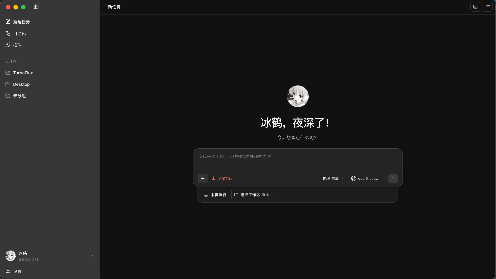

# TurboFlux

English | [中文](README.zh.md)

TurboFlux is an open-source local agent workbench built around an execution kernel and an Electron desktop application. Configure your own model provider, work with local projects, and follow tasks, approvals, and results from the Desktop.



## Current scope

- **Domain packages and Agent Runtime**: model integration, agent execution, tools, context management, conversations, Skills, MCP, Plugins, and local profile services.
- **Desktop**: task and conversation UI, settings, local profiles, browser and computer adapters, terminal integration, and automation.
- **Desktop remote control support**: a paired browser client and encrypted protocol for controlling an authorized Desktop. Execution and model credentials stay on the Desktop host.

## Quick start

Use Node.js **22.12 or newer**, npm, and [ripgrep](https://github.com/BurntSushi/ripgrep). Install dependencies at the repository root so npm links the workspace packages.

```sh
git clone https://github.com/MengShengbo/TurboFlux.git
cd TurboFlux
npm ci
npm run dev:desktop
```

Configure your model endpoint and API key in Desktop settings. Desktop runs on macOS, Windows, and Linux; its integrated terminal uses zsh, PowerShell, and bash respectively. Native capabilities depend on the host operating system and permissions; computer control is currently available on macOS only.

The development server defaults to `http://127.0.0.1:15174`. To use another port:

```sh
TURBOFLUX_DESKTOP_PORT=25174 npm run dev:desktop
```

## Repository layout

| Path | Responsibility |
| --- | --- |
| [`packages/agent-runtime`](packages/agent-runtime) | Agent execution, context, and lifecycle |
| [`packages/workbench`](packages/workbench) | Application composition; sibling domain packages own models, tools, conversations, extensions, profiles, and automation |
| [`packages/renderer`](packages/renderer) | Browser rendering engine; `presentation` owns pure view projections |
| [`packages/agent-core`](packages/agent-core) | Compatibility exports for existing consumers |
| [`apps/desktop`](apps/desktop) | Electron application, renderer, and native host adapters |
| [`packages/remote-protocol`](packages/remote-protocol) | Desktop device pairing, capability grants, encrypted commands, and events |
| [`apps/remote-mobile`](apps/remote-mobile) | Desktop's remote-control PWA |
| [`apps/model-proxy`](apps/model-proxy) | Optional local model proxy |
| [`docs`](docs/README.md) | Architecture, development, privacy, and operations |
| `scripts` | Build, boundary checks, packaging, benchmarks, and acceptance tools |

Desktop consumes the kernel through its public package exports. `DesktopRuntimeHost` assembles `WorkbenchRuntime`, which creates `AgentRuntime` and `AgentEngine`. The host supplies native browser, computer, and terminal capabilities. See the [package architecture](docs/architecture/packages.md), [architecture overview](docs/architecture/project-overview.md) and [repository boundary](docs/architecture/repository-boundary.md).

## Development

```sh
npm run build                 # kernel and Desktop, including remote control assets
npm run type-check            # kernel type checks
npm test                      # kernel tests
npm run type-check:desktop
npm run test:desktop
npm run test:remote
npm run verify:boundary
npm run verify:architecture
npm run verify:workspace
npm run ci                    # complete local check sequence
```

`npm run build:core` builds the kernel alone. To package an unpacked Desktop application, run `npm run package:dir --workspace @turboflux/desktop`. Signing and platform-specific distribution require the corresponding platform toolchain and certificates.

Windows development, PowerShell configuration, and NSIS packaging are covered in the [Windows guide](docs/windows.md).

For Desktop remote control setup, see the [runbook](docs/architecture/remote-shell-runbook.md). The browser client requires trusted HTTPS and pairing with the Desktop host.

## Contributing

Report bugs and suggestions in [Issues](https://github.com/MengShengbo/TurboFlux/issues). External pull requests are currently not accepted; see [CONTRIBUTING.md](CONTRIBUTING.md).

## License

[MIT](LICENSE)
