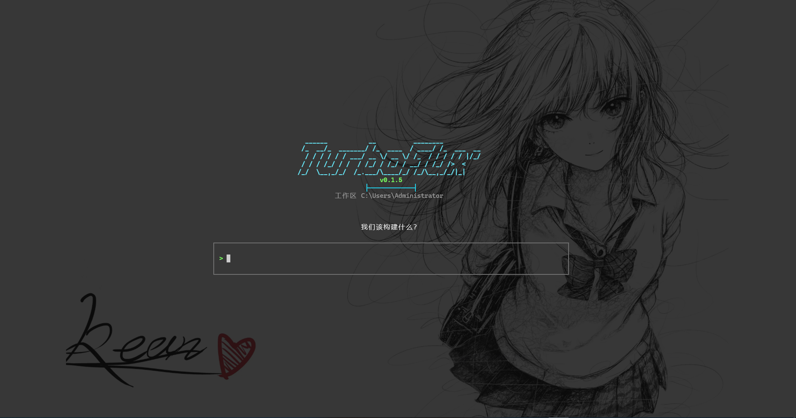

<p align="center">
  
</p>

<h1 align="center">TurboFlux</h1>

<p align="center">A local TUI coding agent for real workspaces.</p>

<p align="center">
  
  
  
</p>

TurboFlux is a terminal user interface (TUI) for AI-assisted development. It takes
a project directory and a task, then searches code, edits files, runs commands,
and reports progress and diffs in an Ink-based terminal UI.

<p align="center">
  
</p>

> [!NOTE]
> TurboFlux is under active development. Commands, configuration, and UI details may change.

## Quick start

Requires Node.js 20 or newer.

```bash
npm install -g turboflux
turboflux setup
cd your-project
turboflux
```

The setup wizard configures a model provider. Then enter a task directly, for example:

```text
Inspect the login flow, fix session re-authentication, and run the relevant tests.
```

The npm package is the only supported end-user installation channel. GitHub
hosts the source code and project documentation.

## Features

- Search and read code, edit files, and run foreground or background commands.
- Show file- and hunk-level unified diffs with tool execution status.
- Persist conversations with history restore, context compaction, and workspace memory.
- Inspect, commit, restore, and revert agent changes through isolated Git operations.
- Connect to OpenAI, Anthropic, DeepSeek, Kimi, GLM, OpenRouter, and custom OpenAI-compatible APIs.
- Extend the workspace with Skills, MCP servers, and custom subagents.

## Configuration

```bash
turboflux setup api          # Configure an API connection
turboflux setup language     # Configure UI and output language
turboflux setup persona      # Configure response style
turboflux setup approval     # Configure tool approval policy
turboflux setup show         # Show the active configuration
```

Normal settings are stored in `~/.turboflux/config.json`; API credentials are
stored separately in `~/.turboflux/credentials.json`.

Run a project or a single task:

```bash
turboflux /path/to/project
turboflux /path/to/project --command "Inspect the login flow and fix the issue"
```

## Modes and approvals

| Mode | Behavior |
| --- | --- |
| `vibe` | Default mode; search, edit, and validate the project. |
| `plan` | Read-only analysis and planning. |

Use `/vibe` and `/plan` to switch modes, and `/effort` to adjust the active model's reasoning effort.

| Approval policy | Behavior |
| --- | --- |
| `ask` | Ask before writing files or running commands. |
| `agent` | Continue low-risk actions automatically and ask when risk is detected. |
| `full` | Hide approval prompts and enable full workspace, command, and network access. |

Override the configured policy for one run with `--approval-policy <policy>`.

## Common commands

| Command | Purpose |
| --- | --- |
| `/help` | Show all commands. |
| `/model` | Select or add a model. |
| `/plan`, `/vibe` | Switch work mode. |
| `/effort` | Adjust reasoning effort. |
| `/approval` | Change the approval policy. |
| `/context`, `/compact` | Inspect or compact context. |
| `/resume`, `/new` | Restore or start a conversation. |
| `/mcp`, `/skills` | Inspect loaded extensions. |
| `/git [on\|off\|refresh]` | Inspect or refresh Git integration. |

Press `Esc` twice in the input field to restore the previous message for editing.
When a provider returns reasoning content, press `Ctrl+O` to expand or collapse it.

## Git integration

Git integration is enabled by default. Automatic commits use an isolated index,
so existing staged changes stay untouched and nothing is pushed automatically.
Structured Git tools do not force-push, hard-reset, or clean the working tree.

## Workspace rules and extensions

Put project rules in `TURBOFLUX.md`. TurboFlux also reads `CLAUDE.md`, `AGENTS.md`,
`.cursorrules`, and `.cursor/rules/` when present.

MCP is disabled by default. Select a server from the command line:

```bash
turboflux . --mcp all
turboflux . --mcp server-name
```

The current MCP transport is stdio. See the [documentation index](docs/README.md)
and the [provider/API compatibility guide](docs/provider-api-compatibility.md).

## Terminal features

On Windows, `Ctrl+V` can paste a clipboard image, or a message can contain a
local image path. PNG, JPEG, WebP, GIF, and BMP are supported up to 5 MB per image;
the selected model must support vision input.

TurboFlux normally renders an opaque background. Windows Terminal transparency,
Acrylic, and background images are detected automatically. Override detection with
`turboflux . --transparent`, `--opaque`, or `TURBOFLUX_TRANSPARENT`.

## Development

```bash
npm ci
npm run dev:once -- .
npm test
npm run type-check
npm run build
```

Start with the [documentation index](docs/README.md):

- [System overview](docs/architecture/system-overview.md)
- [Local development](docs/guides/development.md)
- [Testing strategy](docs/guides/testing.md)
- [Troubleshooting](docs/operations/troubleshooting.md)
- [Provider/API compatibility](docs/provider-api-compatibility.md)
- [Contribution guide](CONTRIBUTING.md)

## License

MIT
