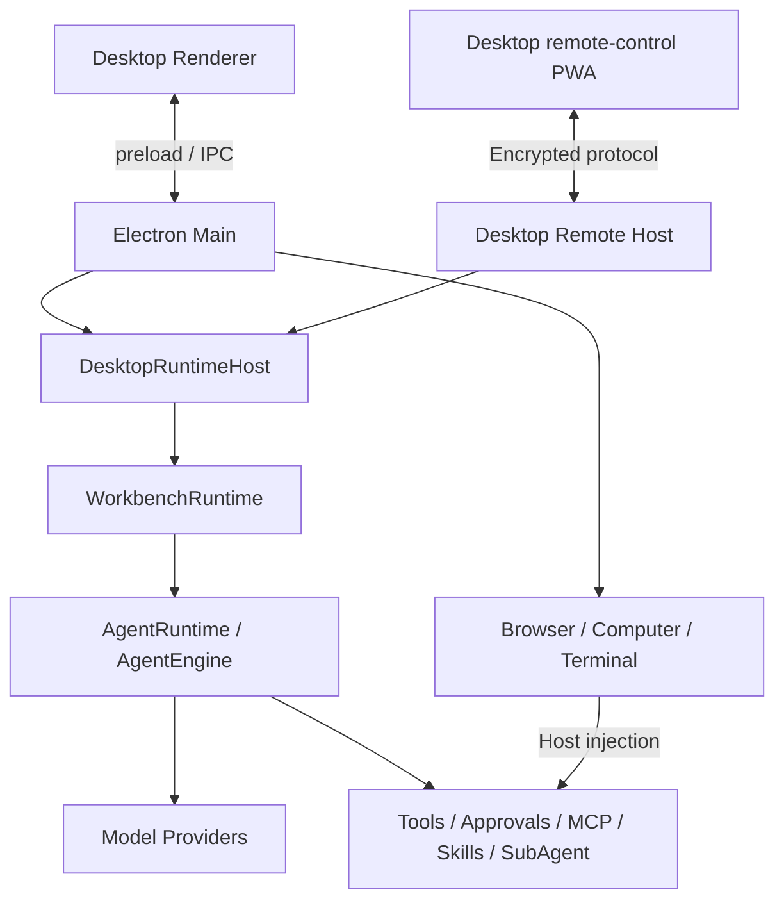

# TurboFlux 架构总览

本文描述仓库中的 Agent Core 和 Desktop 实现。仓库根目录是 npm workspace 根目录，可以独立安装、构建和测试。

## 组成与技术栈

| 目录 | 技术与职责 |
| --- | --- |
| `packages/agent-core` | TypeScript、Node.js；执行引擎、模型接入、工具、会话与应用服务 |
| `apps/desktop` | Electron、Vite、TypeScript、HTML/CSS；桌面工作台和原生宿主 |
| `packages/remote-protocol` | TypeScript、Web Crypto 与 Node.js；桌面远控配对、授权、加密和事件同步 |
| `apps/remote-mobile` | Vite PWA；Desktop 的浏览器远控界面 |
| `scripts` | 开发、打包、边界检查、性能基准和验收工具 |

依赖通过 npm workspaces 管理，类型检查使用 TypeScript，测试使用 Vitest，静态检查使用 oxlint，桌面打包使用 electron-builder。

## Desktop 调用链

Renderer 提交用户操作并展示快照。主进程拥有窗口、系统权限、原生集成和生命周期。
`DesktopRuntimeHost` 装配运行时、工作区和桌面自动化；`WorkbenchRuntime` 组织会话、任务、设置和应用服务。
`createAgentRuntime` 装配 `AgentEngine`、审批协调、会话注册和工具执行，事件与快照向界面提供流式内容和任务状态。

## 内核分层

| `packages/agent-core/src/` | 职责 |
| --- | --- |
| `kernel/` | 包导出和公共契约 |
| `application/` | conversations、flow、work、workbench、automations、profiles、plugins、projects、artifacts 等应用服务 |
| `core/` | AgentEngine、Provider、上下文、审批、SubAgent、MCP、Skills 和运行时协调 |
| `tools/` | 内置工具和 Memory 能力 |
| `platform/`、`shared/`、`state/` | 平台适配、共享类型和基础状态 |
| `server/` | 模型 API 代理与管理页面，作为依赖下层的叶子层 |

应用使用 `@turboflux/agent-core` 的 `contracts`、`runtime`、`renderer`、`workbench`、`extensions` 导出，不深度导入内部源码或构建文件。
内核不依赖 Electron 或产品界面。原生驱动由 Desktop 注入。持久化由应用服务及 Repository 管理，Renderer 不承担持久化事实来源。

## 桌面远控

`remote-protocol` 定义设备配对、能力授权、加密信封、幂等命令和可恢复事件游标，并提供宿主与浏览器适配。
远控 PWA 操作已授权的 Desktop；模型凭据、工作区文件和实际执行保留在桌面主机。
远控资源是 Desktop 构建的一部分，参见[远控架构](decentralized-remote-shell.md)及[运维指南](remote-shell-runbook.md)。

## 源码阅读入口

| 阅读目标 | 入口 |
| --- | --- |
| Desktop 界面与桥接 | [renderer/main.ts](../../apps/desktop/renderer/main.ts)、[preload.cjs](../../apps/desktop/preload.cjs) |
| 主进程与运行时宿主 | [main.mjs](../../apps/desktop/main.mjs)、[runtimeHost.ts](../../apps/desktop/runtimeHost.ts) |
| 应用编排 | [workbenchRuntime.ts](../../packages/agent-core/src/application/workbench/workbenchRuntime.ts) |
| Agent 装配与执行 | [agentRuntime.ts](../../packages/agent-core/src/core/runtime/agentRuntime.ts)、[agentEngine.ts](../../packages/agent-core/src/core/agentEngine.ts) |

安装与验证命令见[项目 README](../../README.zh.md)，包依赖及发布约束见[仓库边界](repository-boundary.md)。
