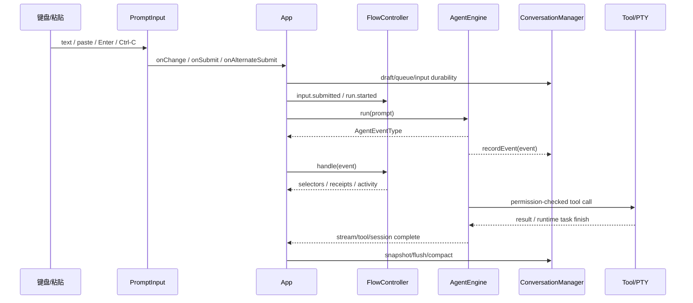

# TUI 运行生命周期

## 从按键到回合

## 输入状态

`PromptInput` 的输入处理包括：

- 受控 `value` 与 ref 同步，避免高频输入闭包过期。
- `/` 开头无空格时从命令注册表提供补全。
- 上下键在补全和 prompt history 间切换，并可恢复未提交 draft。
- image placeholder 作为整体 token 移动和删除。
- 粘贴与快速字符 burst 触发 newline guard，避免多行粘贴意外提交。
- Enter 插入换行；Ctrl/Meta+Enter 走 alternate submit；双 Esc 触发 rewind。

App 在提交后根据运行状态分流：空闲时执行 slash command 或启动 run；运行中优先接受 steer，否则进入 queue；持久化 degraded 时除 `/flow`、`/help`、退出等恢复命令外阻断提交。

## Run 状态

Engine 的 `AgentRunState` 细粒度阶段包含 idle、thinking、tool_running、awaiting_approval、awaiting_input、paused、aborting、recoverable_error、completed 等。Flow reducer 将它投影为 idle、starting、active、stopping、terminal，并保留原始 agentState 给 UI。

`AgentEngine.run()` 同时只允许一个 foreground promise；每次 run 清理 run grants、steering、工具 ledger 和 workspace memory cache，先初始化 Git，再准备 context，循环执行 model → tool calls → tool results，直到无工具调用或 abort。

## Streaming

Provider stream 由 Engine 解析为 answer、thinking 和 partial tool-call delta。App 维护短期 buffer；Flow 记录 stream.started/delta/ended；Conversation Journal 记录 v1 stream entries。`AdaptiveStreamScheduler` 只负责 UI flush 时机，不改变 Engine 事件顺序。

stream end 后：

- 固定 cockpit 清理 buffer 并保持滚动锚点。
- scrollback 模式将完成消息放进 `Static` 历史。
- 中断时保留可见文本、thinking、工具和 change summaries，并标记 interrupted。
- `turn:complete` 到达后 App 才把稳定 assistant message 加入 transcript。

## Tool/Approval

Engine 对每个 tool call 依次执行：模式限制 → disabled 工具 → required mode → 参数 schema → PermissionPipeline → dispatchTool → 结果预算/错误分类 → change summary。

并发执行只发生在工具元数据声明 concurrency safe 且不构成 read-after-write 风险的连续批次。工具结果回到 Engine 形成 tool_result turn，再继续 model loop。

需要用户决定时，`ApprovalCoordinator` 管理 requested/resolved/cancelled，App 的 `ApprovalPresentationScheduler` 决定何时展示 modal；两者不应混为一个状态源。

## 后台终端与 Runtime Task

`run_command(run_in_background=true)`、PTY session、shell 和 subagent 通过 `RuntimeTaskManager` 表达。TUI 使用 `terminal:sessions` 和 `runtime-task:finished` 更新 footer、sidebar、system message 和通知 inbox；`/ps` 与 `/stop` 直接查询/控制 RuntimeTaskManager。

Runtime Journal 记录 task event 和 runtime metadata。恢复后的任务如果无法重新控制，会标记 `orphaned`、`recovered: true`、`controlAvailable: false`，UI 允许查看但不假装可停止。

## Conversation Journal 与恢复

ConversationManager：

1. 首个 Engine 事件初始化 meta。
2. turn/tool/stream/context/approval/input 事件按 critical/terminal/streaming durability 写入。
3. streaming delta 与 draft 可按 80ms 批量合并；关键事件直接写并在失败时抛出。
4. 失败后进入 degraded，App 显示 persistence warning，普通 run/new/switch 被阻断。
5. `/flow retry` 写探针并重试；`/flow export` 生成脱敏、只读 recovery bundle。
6. `/resume`/history 通过 store replay snapshot 与 journal，恢复 Engine turns、messages、context、queue、draft、steering 和 pending approval 提示。

恢复不会恢复完整 Flow Store seq 或 React presentation cache；这些在 App 创建新 thread 时重新建立。

## 关闭顺序

App effect cleanup 清除 scheduler/timer、通知与 attention；随后 Runtime destroy 断开 MCP、停止任务、关闭 PTY、解绑 session/task 监听并销毁 Engine；ConversationManager flush journal 后关闭 writer。新增资源必须加入同一清理链路并有测试。
