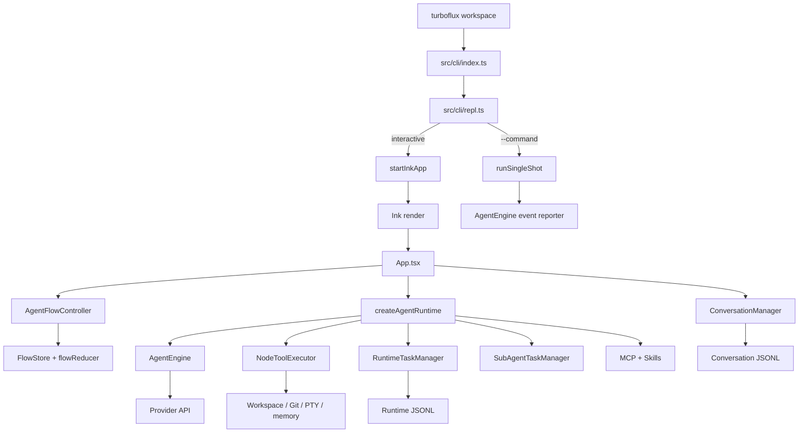

# TUI 系统总览

## 产品边界

TurboFlux 是本地单进程 TUI。交互式入口使用 Ink 渲染；`--command` 提供复用同一 Runtime 的 single-shot 输出；`src/server` 是可选 OpenAI-compatible 代理服务，不是 TUI 启动链的组成部分。

## 真实启动链



## 两种 Ink 输出模式

交互式默认启用固定 cockpit：alternate screen、incremental rendering、24 FPS、TranscriptViewport、可选 transcript windowing、鼠标滚动和 sidebar。关闭 no-flicker、使用 single-shot 或非 TTY 时走 scrollback/static 路径：历史消息进入 Ink `Static`，底部保留运行区、输入框、终端 footer 和 StatusLine。

模式选择由 `shouldUseNoFlicker()`、`startInkApp()` 和 `App` 的 `noFlickerActive` 共同决定；不要只看 CLI 参数名推断实际渲染模式。

## TUI 组合关系

`App` 是当前 TUI composition root：

- 创建 `AgentRuntime`、`AgentFlowController`、`ConversationManager`、`LocalFlowTelemetry`、`TerminalLatencyTracker`。
- 把 `AgentEngine` 的事件同时交给 `flowBridge.handle(event)`、`ConversationManager.recordEvent(event)` 和 React 本地状态处理。
- 把 Flow selectors 投影成 Activity、queue、approval、background count、token usage 和 status line。
- 根据 overlay、landing、cursor、ask modal、running panel 和 terminal size 选择 Ink 子树。

`createAgentRuntime()` 是 core 对象图组合根，负责核心服务间连接；它不拥有 Ink 组件，也不决定 TUI 布局。

## 事件与状态方向

```text
AgentEngine AgentEventType
       ├──> AgentFlowController -> FlowEventEnvelope -> FlowStore -> selectors -> App UI
       ├──> ConversationManager -> ConversationJournalWriter -> conversation JSONL
       └──> App event switch -> stream/tool/notification/terminal presentation cache
```

Flow 事件 schema v2 带 session/thread/run/turn/item identity 和 thread-local seq。Flow Store 在内存中保存每个 thread 的状态与 invariant violations；它不是持久化日志。Conversation Journal 另有 v1/v2 entry schema，恢复时重放会话事实。

## UI 责任地图

| UI 区域 | 主要实现 | 事实来源 |
| --- | --- | --- |
| Landing | `LandingView`、`StartupAnimation` | App 派生的消息/运行/overlay 条件 |
| Prompt | `PromptInput`、`TerminalInputStateMachine` | React value/ref + command registry |
| Transcript | `MessageList`、`WindowedMessageList`、`TranscriptViewport` | App messages + viewport metrics |
| Active work | `ActiveWorkPanel`、`ToolCallTree` | Engine events + Flow selectors |
| Approval | `ApprovalPresentationScheduler`、`PermissionDialog` | Engine interactive request + Flow approval |
| Status | `StatusLine`、`AgentActivityLine` | Flow primary activity + Git/model/terminal counts |
| Sidebar | `SessionSidebar`、`CockpitRails` | App 本地展示状态与 Flow 派生状态 |
| History | `ConversationHistory`、`RewindSelector` | ConversationManager + Engine restore |
| Notifications | `NotificationCoordinator`、`TerminalAttention` | App coordinator；Flow 只记录 notification raised |

## 辅助能力

模型协议、工具执行、Git、MCP、Skills、子代理和 Runtime Tasks 都由 TUI 通过 Runtime 使用。它们不是独立进程；除可选 `src/server` 外，默认所有能力在同一 Node 进程内执行。

## 当前边界与工程热点

- `App.tsx` 同时负责装配、事件桥接、交互状态和渲染，是首要拆分目标。
- `AgentEngine` 和 `NodeToolExecutor` 都是大型多职责后端，文档按现状描述，不把它们假设成已拆分服务。
- 固定 cockpit 与 scrollback 必须保持行为兼容，任何 UI 变更都要验证两条路径。
- Flow 与 Conversation 是两个不同状态系统；如果未来统一，必须先写 ADR 和迁移方案。

详细证据见[TUI 源码深读审计](../tui-source-audit.md)，目录和测试见[模块地图](../reference/module-map.md)与[测试策略](../guides/testing.md)。
