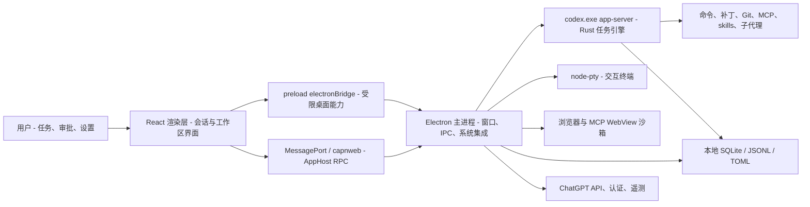
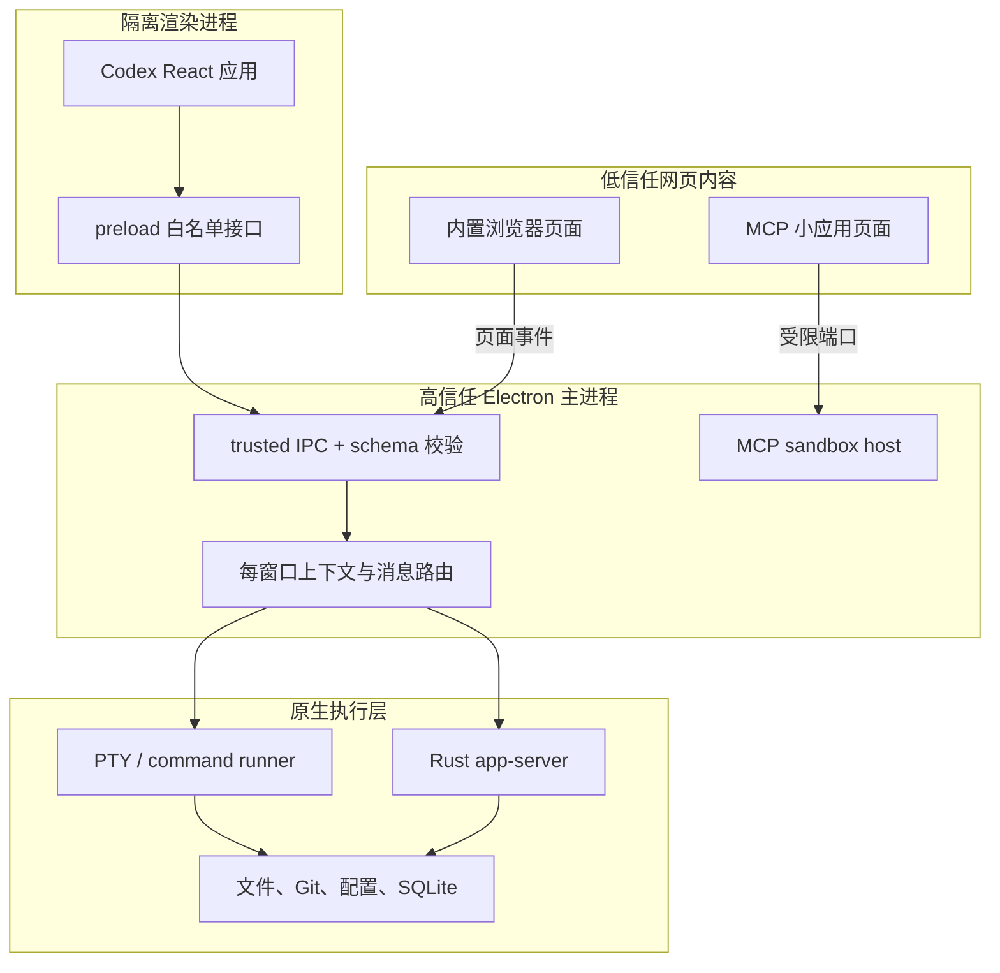
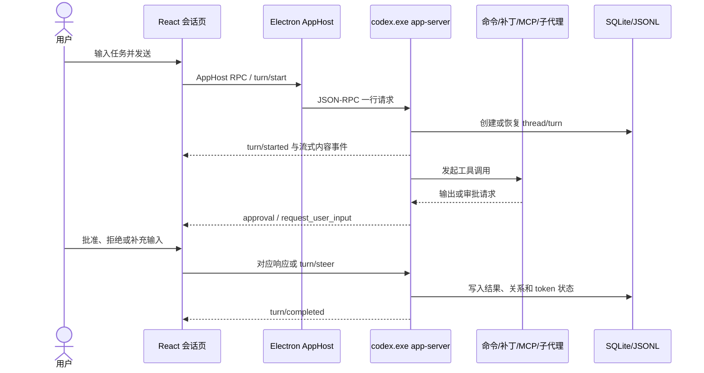

# Codex 桌面端源码逆向审计

## 审计结论

- 模式：OpenVC hybrid + audit，图谱深度为 `deep`。
- 对象：本机官方 `OpenAI.Codex_26.721.4979.0_x64__2p2nqsd0c76g0`，不包含同机第三方应用。
- 结果：已经恢复 Electron 主进程、preload、渲染入口、Codex 专属业务 chunk、IPC 通道、Rust app-server JSON-RPC 方法、数据落点和二进制指纹。
- 边界：包内没有 source map，因此拿到的是可执行级 JavaScript，而不是原始 TypeScript 文件名、类型、注释和测试。Rust 后端恢复到了二进制边界、启动参数、协议和状态模型，没有把 353 MB PE 反编译成伪 Rust。
- 删除判断：本次发现的“薄 chunk”不是死代码。它们由动态 import 表加载，静态 import 扫描会误判为孤岛；没有证据支持删除 AppX 中任何 Codex 业务文件。

## 扫描范围

包含：

- `.vite/build/*.js`：21 个 Electron 主进程与 preload bundle。
- `webview/assets` 的启动链：`index`、`rpc`、`app-main`、`app-initial`。
- Codex 专属渲染块：工作区、worktree、Git、终端、MCP、skills、subagent、diff、审批和本地会话。
- `resources` 下的 Rust/辅助可执行文件与签名。

忽略：

- 语言高亮、主题、图标、通用 ChatGPT 页面等 4,000 余个渲染资产。
- 图片、字体和 CSS 的像素级分析。
- 运行时账号数据、会话正文和认证令牌。

OpenVC 对 51 个筛选后的 JavaScript 文件完成了无截断扫描。由于发布 bundle 被压成一至数行，复杂度和“UI 直连数据库”类启发式命中只作为候选，最终结论以直接代码检查为准。

## 源码统计

| 项目 | 结果 |
| --- | ---: |
| AppX 版本 | `26.721.4979.0` |
| 内部包版本 | `26.721.41059` |
| 构建号 | `5848` |
| Electron | `42.3.0` |
| ASAR 大小 | `209,728,412` bytes |
| ASAR SHA-256 | `44884F86D619A12C3C0AF1B8C65945005BDA4379775B03270674C666226FF4B7` |
| ASAR 条目 | `6,175` |
| 主进程 JavaScript | `21` 个 |
| 渲染 JavaScript | `4,504` 个 |
| Codex 关键词业务候选 | `65` 个 |
| source map | `0` 个 |
| 核心公共渲染包 | `app-initial-BbEVL4-_.js`，约 `14.0 MB` |

## 系统全景



通俗读法：React 页面本身不直接拥有 Node 文件系统能力。它通过 preload 暴露的小桥或一条 MessagePort RPC 连接主进程；主进程再把 Codex 任务送给 Rust app-server，后者负责线程、回合、命令、补丁、工具和审批事件。

纯文本回退：`用户 → React → preload/AppHost RPC → Electron 主进程 → Rust app-server → 工具与本地状态`。

## 启动链

### 桌面主进程

1. `AppxManifest.xml` 启动 `app/ChatGPT.exe`。
2. `package.json` 把入口指定为 `.vite/build/early-bootstrap.js`。
3. `early-bootstrap.js` 初始化运行时兼容层和桌面打开路径队列，再异步加载 `bootstrap-DuAm2XSG.js`。
4. `bootstrap-DuAm2XSG.js` 处理用户数据目录、单实例、平台安装迁移、崩溃与日志初始化，然后进入 `main-DS6zBDC3.js`。
5. `main-DS6zBDC3.js` 创建窗口上下文、注册 IPC、初始化 Codex app-server、自动化、终端、浏览器、托盘、更新器和退出排空逻辑。

### 渲染进程

1. `webview/index.html` 加载 `index-DqK89hOt.js`。
2. `index` 先加载 `rpc-CDAeVAJt.js`，初始化 AppHost 服务。
3. 随后加载 `app-main-CAoq-qgz.js`，注册全局错误处理并挂载 React 根节点。
4. 大多数协议定义、状态容器、路由和公共组件集中在 `app-initial-BbEVL4-_.js`。
5. 工作区、skills、MCP、worktree 等页面由动态 import 按需加载。

## 进程与信任边界

主窗口配置确认了 `contextIsolation: true`、`nodeIntegration: false`，并通过 `preload.js` 注入 `electronBridge`。主窗口按外观类型决定是否启用 `webviewTag`；MCP guest WebView 额外明确设置：

- `sandbox: true`
- `contextIsolation: true`
- `nodeIntegration: false`
- `webSecurity: true`
- `plugins: false`
- 禁止弹窗，限制导航与重定向

主进程的关键 IPC handler 都先调用 `isTrustedIpcEvent`。MCP 沙箱初始化还校验 guest 所属 owner、sandbox id、`https:` / `codex-sandbox:` origin、`initId`、端口名白名单和 MessagePort 数量。



通俗读法：网页内容、React 页面、主进程和原生执行层分成四级。真正能改文件或启动进程的是最内层；外层请求必须经过 preload、来源检查和消息 schema。

纯文本回退：`网页沙箱 → 受限端口 → 主进程校验 → Rust/PTY → 文件和进程副作用`。

## IPC 逆向表

| 通道 | 方向 | 作用 |
| --- | --- | --- |
| `codex_desktop:message-from-view` | renderer → main | 通用桌面消息总线；窗口、设置、workspace、托盘等消息在此分派 |
| `codex_desktop:message-for-view` | main → renderer | 事件、共享对象、状态变更；大对象支持分块发送 |
| `codex_desktop:chunked-message-ack` | renderer → main | 分块消息序号确认与背压 |
| `codex_desktop:connect-app-host` | renderer → main | 传递 MessagePort，建立 capnweb AppHost RPC |
| `codex_desktop:worker:{id}:from-view` | renderer → main | 指定后台 worker 的请求 |
| `codex_desktop:worker:{id}:for-view` | main → renderer | 指定后台 worker 的事件 |
| `codex_desktop:mcp-app-sandbox-guest-message` | MCP guest → main | MCP 小应用初始化和端口交接 |
| `codex_desktop:mcp-app-sandbox-host-message` | main → renderer | MCP host 侧消息 |
| `codex_desktop:browser-sidebar-runtime-message` | 双向 | 浏览器侧栏编辑、标注、截图、导航与拖拽 |
| `codex_desktop:browser-page-event` | page → main | 内置浏览器页面事件 |
| `codex_desktop:show-context-menu` | renderer → main | 构造原生菜单并回传所选 id |
| `codex_desktop:start-file-drag` | renderer → main | 启动原生文件拖拽 |
| `codex_desktop:get-*` | renderer → main | 构建 flavor、主题、Sentry、共享对象和 sidebar bootstrap 的同步快照 |

通用消息总线直接处理的顶层类型包括：

- 窗口：`open-in-main-window`、`open-in-new-window`、`show-settings`、`quit-app`。
- workspace：`electron-set-active-workspace-root`、新增、重命名、清理 workspace root。
- 桌面能力：`electron-desktop-features-changed`、`reload-bundled-plugins`。
- 画中画与 avatar overlay：active thread、hidden thread、layout 和诊断状态。
- 托盘：`tray-menu-threads-changed`。

其余消息交给全局 handler 或发送者所属的 window context，避免所有窗口共享一份未经隔离的状态。

## Rust app-server

### 启动方式

默认命令已经从 bundle 中恢复：

```text
codex.exe -c features.code_mode_host=true app-server --analytics-default-enabled
```

主进程按以下顺序找 CLI：

1. host 配置中的 `codex_cli_command`。
2. `CODEX_CLI_PATH`。
3. Electron `resources/codex.exe` 或 unpacked 路径。
4. 开发环境仓库/扩展目录。
5. Windows 可选 WSL 路径。

WindowsApps 中的主二进制会和 `codex-code-mode-host.exe`、`codex-windows-sandbox-setup.exe`、`codex-command-runner.exe` 一起复制到用户可执行的稳定目录。主进程给 app-server 设置 `LOG_FORMAT=json`、默认 `RUST_LOG=warn` 和 `CODEX_INTERNAL_ORIGINATOR_OVERRIDE=Codex Desktop`，并清理可能污染执行环境的 PATH 条目。

### 传输

- 常规模式：stdin/stdout 逐行 JSON-RPC，stderr 作为诊断流。
- stdout 有增量 JSON 解析、超大行监控、队列深度阈值和分片调度，避免大型历史/工具结果阻塞 Electron 事件循环。
- 非 Windows 本地模式可探测 `app-server daemon version`，再通过 `app-server-control/app-server-control.sock` 连接 `ws://localhost/rpc`。
- 远程 host 也使用统一 WebSocket 传输抽象。

### 请求方法

| 域 | 已确认的方法 |
| --- | --- |
| 账号 | `account/read`、`account/login/start`、`account/login/cancel`、`account/logout`、`account/rateLimits/read`、`account/usage/read` |
| 线程 | `thread/start`、`thread/read`、`thread/list`、`thread/resume`、`thread/fork`、`thread/archive`、`thread/unarchive`、`thread/delete`、`thread/search` |
| 线程状态 | `thread/items/list`、`thread/turns/list`、`thread/name/set`、`thread/settings/update`、`thread/metadata/update`、`thread/goal/get`、`thread/goal/set`、`thread/memoryMode/set` |
| 回合 | `turn/start`、`turn/steer`、`turn/interrupt`、`thread/rollback`、`thread/compact/start`、`review/start` |
| 实时语音 | `thread/realtime/start`、`appendText`、`appendSpeech`、`listVoices`、`stop` |
| 配置 | `config/read`、`config/value/write`、`config/batchWrite`、`config/mcpServer/reload` |
| skills/plugins | `skills/list`、`skills/config/write`、`skills/extraRoots/set`、`plugin/list`、`plugin/read`、`plugin/install`、`plugin/uninstall`、`plugin/skill/read` |
| 命令与文件 | `command/exec`、`fs/readFile`、`fs/writeFile`、`fs/readDirectory`、`fs/createDirectory`、`fs/copy`、`fs/remove`、`fs/watch` |
| 模型 | `model/list`、`model/verification`、`account/chatgptAuthTokens/refresh` |

### 事件流

已确认事件覆盖：

- 生命周期：`thread/started`、`thread/status/changed`、`turn/started`、`turn/completed`。
- 内容：agent message、reasoning、plan、diff、token usage、stream error。
- 工具：exec begin/end/output delta、patch begin/end、MCP tool begin/end、web search、view image、dynamic tool call。
- 人机门：exec approval、apply-patch approval、request user input、MCP elicitation。
- 多代理：spawn、resume、waiting、interaction、close 的 begin/end 事件。

## 一次任务的完整生命周期



通俗读法：每个任务都是 thread 下的一个 turn。UI 只负责呈现和收集决定；Rust 引擎维护状态、调度工具，并在有副作用前发审批事件。

纯文本回退：`发送任务 → turn/start → 状态写入 → 工具/审批循环 → turn/completed → UI 更新`。

## 关键业务模块

### Worktree 与本地环境

- composer 可选择当前分支、远程分支、携带本地改动或指定本地环境。
- 建立状态包含 `creating`、`setting-up`、`worktree-ready`、`failed`。
- setup 失败时，`worktree-setup-auto-fix` 会创建专门的修复 thread，而不是直接在 UI 内执行任意命令。
- 本地环境支持跨平台 setup/cleanup 脚本、动作和环境变量；保存时有磁盘冲突检测。
- worktree 设置支持自定义根目录、自动清理开关和保留数量。界面文案与恢复事件表明清理前会保留快照，并提供 restore 流程。

### Git 与 Pull Request

- Git 设置包含 branch prefix、commit/PR 指令、draft PR、merge/squash 和 `--force-with-lease`。
- 本地会话摘要读取 `gh pr view`、`gh pr checks`，显示评论、冲突和 CI 状态。
- commit、rebase、diff 页面是薄渲染 chunk；实际仓库操作由 app-server/命令层承担。

### 终端

- 交互终端由 `node-pty` 提供，支持 data、exit、resize、write、terminate。
- Windows 通过隐藏 PowerShell 调用 `GetConsoleProcessList`，辅助识别 PTY 进程树。
- 后台终端支持 start、restart、stop、clean，并在 thread summary 中单独展示。
- 非交互命令通过 `command/exec` 与 `command/exec/outputDelta` 流式传输。

### MCP 与 skills

- MCP 设置沿用插件设置容器，但执行型 MCP App 使用独立 sandbox WebView。
- sandbox 仅接受明确列出的端口能力，例如 `runWidgetCode`、主题、safe area、工具输入/结果通知和资源 teardown。
- skills 支持 installed/recommended、本地/repo/admin scope、刷新、创建、额外根目录和配置写入。
- 新安装 skill 在 composer 使用前需要显式刷新，说明 skills 有独立缓存/发现周期。

### Subagent

- `subagent-panel` 本身只有约 4.5 KB，主要负责展示；数据模型位于公共包和 app-server 事件层。
- `thread_spawn_edges` 保存父子线程关系，`thread_dynamic_tools` 保存线程动态工具。
- 事件覆盖 spawn、resume、waiting、interaction 和 close，UI 另有 `subagent-thread-full-fidelity-changed` 控制完整历史加载。

## 本地数据与状态

默认 `CODEX_HOME` 是 `%USERPROFILE%\.codex`。

| 路径 | 所有者 | 内容 |
| --- | --- | --- |
| `.codex/config.toml` | Rust CLI + Electron 配置入口 | 模型、MCP、sandbox、notify、feature 与用户设置 |
| `.codex/state_5.sqlite` | Rust app-server | thread 主状态、归档标志、rollout 路径及 app-server 关系表 |
| `.codex/sessions` | Rust app-server | 活跃会话 JSONL rollout |
| `.codex/archived_sessions` | Rust app-server | 归档会话 JSONL |
| `.codex/sqlite/codex.db` | Electron 桌面层 | inbox、automations、automation runs、本地 thread catalog、timeline ledger |
| `.codex/sqlite/codex-history-snapshots.db` | Electron 历史缓存 | 每 principal/host/thread 的规范化历史快照 |

`codex-history-snapshots.db` 的缓存限制已恢复：单 thread 最大约 1 MB，总上限 200 MB，清理目标 160 MB，TTL 约 30 天。

确认存在的 Electron 表：

- `inbox_items`
- `automations`
- `automation_runs`
- `local_app_server_feature_enablement`
- `local_thread_catalog`
- `local_thread_catalog_hosts`
- `local_thread_catalog_metadata`
- `local_thread_catalog_sync_state`
- `thread_timeline_ledger`
- `app_server_history_snapshots`

## 网络面

| 端点 | 用途 |
| --- | --- |
| `https://chatgpt.com/backend-api` | 主产品 API；可由 `CODEX_API_BASE_URL` 覆盖 |
| `https://auth.openai.com`、`https://api.openai.com/auth` | 登录、账号与认证流程 |
| `https://ab.chatgpt.com/v1` | 实验与配置 |
| `https://chat.openai.com/ces/v1/telemetry/intake` | 事件遥测 |
| `https://persistent.oaistatic.com` | 更新与静态发布物 |
| `ws://localhost/rpc` | 本地 app-server daemon 抽象连接 |
| `codex-sandbox://*.web-sandbox.oaiusercontent.com` | MCP App 隔离内容 |

认证请求注入 `Authorization: Bearer ...`、从 JWT 解析的 `ChatGPT-Account-Id`、`originator` 和桌面端 User-Agent。CSP 还允许 `ws.chatgpt.com`、Mapbox 和 OpenAI CDN。

## 二进制清单

| 文件 | 大小 | SHA-256 | 签名 |
| --- | ---: | --- | --- |
| `codex.exe` | 353,628,464 | `39E9E041EA33AC34AAD9578ADFE660C5C7A6DC8F82620B77623960F9352A6EF3` | OpenAI，有效 |
| `codex-code-mode-host.exe` | 53,605,680 | `D339869D655D6B0C3BD0187AD4ED1D2E60B8FD7C43E20A923279C436D0CB79C5` | OpenAI，有效 |
| `codex-command-runner.exe` | 1,302,320 | `30FFF684750BF274D8EBCCFA05721A78BD0EBD9C1C4C29836733C5C6FE3DA36A` | OpenAI，有效 |
| `codex-windows-sandbox-setup.exe` | 8,803,120 | `400CF60D47A8F865E33E43815ECADF3369FE71C4AB830C712AA9E949D6B06AE1` | OpenAI，有效 |
| `codex-computer-use.exe` | 1,699,328 | `2C4CAC168200520C2752058177EA9FE7D1CCF9A26B7287DDDFF669D41CA9AF16` | 未单独签名，位于已签 AppX 内 |
| `rg.exe` | 4,218,880 | `14231169855EC5205CF5A1B6F1DB358FF4AED4247C86B69CE8AAE647C77F6680` | 未单独签名，位于已签 AppX 内 |

## 安全与修改风险

### 已确认的保护

- renderer 默认拿不到 Node API，桌面能力通过窄 preload 暴露。
- IPC 有来源检查，关键消息有 Zod/schema 校验。
- MCP App 使用独立 session、origin/initId/端口校验和导航限制。
- 大对象通道有分块、序号和确认机制。
- 退出时排空状态、设置、日志、Codex micro 和 trace，而不是直接杀进程。

### 高风险修改点

- `CODEX_CLI_PATH`、host `codex_cli_command` 和本地环境 setup/cleanup 都能改变实际执行边界。
- `webviewTag`、浏览器侧栏和 MCP sandbox 是最复杂的跨信任区代码。
- `config.toml`、`state_5.sqlite` 与 Electron 自有 SQLite 同时存在；修改归档/删除逻辑时容易产生双写漂移。
- worktree 删除、自动化执行、终端清理和 approval handler 都可能产生不可逆副作用。
- `app-initial` 是 14 MB 巨型公共包，直接在压缩产物上打补丁的回归面非常大。

## “孤岛文件”复核

| 候选 | 表面现象 | 复核结果 | 删除建议 |
| --- | --- | --- | --- |
| `skills-page-BZmJu7eG.js` | 只有约 111 bytes | 重导出真实 skills 页面 | 保留 |
| `thread-app-shell-chrome-Bfk3Hzvg.js` | 只有约 98 bytes | 重导出平台实现 | 保留 |
| `external-agent-config-import-flow-BdHviC-d.js` | 只有约 96 bytes | 动态 route facade | 保留 |
| `app-D4EiHr_K.js` | 只有约 120 bytes | 启动依赖占位/初始化模块 | 保留 |
| 语言与主题 chunk | 很多没有直接静态 caller | 由语法高亮和主题注册表动态按名加载 | 保留 |
| Codex 功能 chunk | 主入口没有静态 import | `app-initial` 的动态 import 映射按路由/feature gate 加载 | 保留 |

结论：这里的“小文件”和“无入边文件”是 bundler 的代码分割产物，不是可直接删除的源码孤岛。若要做 dead-code elimination，应回到原始 monorepo，在 TypeScript 构建图和 feature gate 配置上执行，而不是删 ASAR 条目。

## 证据文件

- `C:\Program Files\WindowsApps\OpenAI.Codex_26.721.4979.0_x64__2p2nqsd0c76g0\AppxManifest.xml`：AppX 入口、协议和权限。
- `C:\Program Files\WindowsApps\OpenAI.Codex_26.721.4979.0_x64__2p2nqsd0c76g0\app\resources\app.asar`：发布源码容器。
- `C:\Users\Administrator\AppData\Local\Temp\codex-desktop-re-26.721.4979.0\main\preload.js`：renderer 桥和 IPC 名称。
- `C:\Users\Administrator\AppData\Local\Temp\codex-desktop-re-26.721.4979.0\main\main-DS6zBDC3.js`：窗口、IPC、PTY、历史缓存和退出生命周期。
- `C:\Users\Administrator\AppData\Local\Temp\codex-desktop-re-26.721.4979.0\main\src-BPbHdvxe.js`：app-server、协议、配置、SQLite、worktree 和二进制定位。
- `C:\Users\Administrator\AppData\Local\Temp\codex-desktop-re-26.721.4979.0\renderer\assets\app-initial-BbEVL4-_.js`：渲染状态、RPC 方法和动态路由。

## 复现

只提取并生成指纹：

```powershell
.\scripts\extract-codex-desktop.ps1
```

同时格式化提取出的 JavaScript：

```powershell
.\scripts\extract-codex-desktop.ps1 -Format
```

指定输出目录：

```powershell
.\scripts\extract-codex-desktop.ps1 -OutputDirectory C:\Temp\codex-desktop-re
```

脚本不改 AppX，只读取 `app.asar` 并把选定条目写到输出目录，同时生成 `reverse-manifest.json`。
