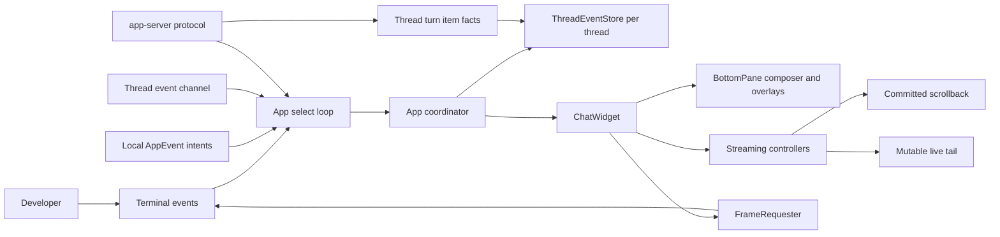
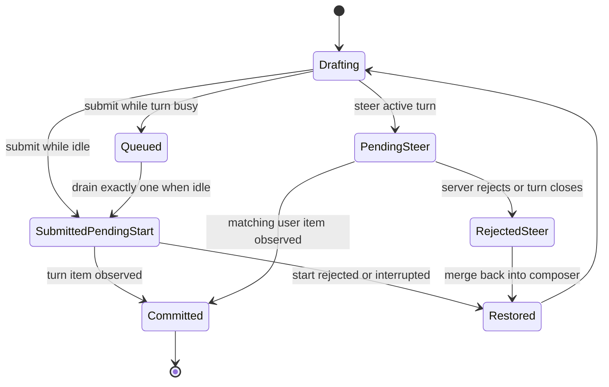
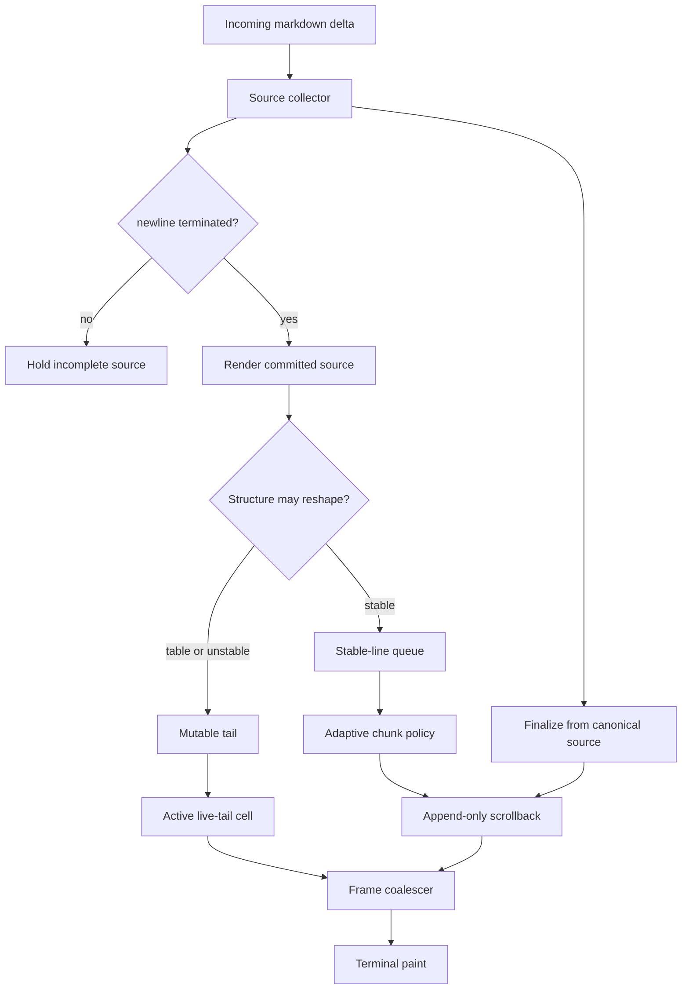
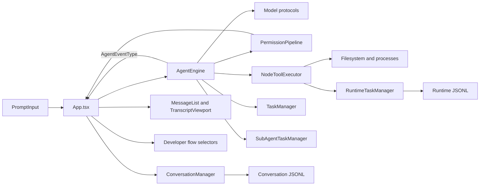
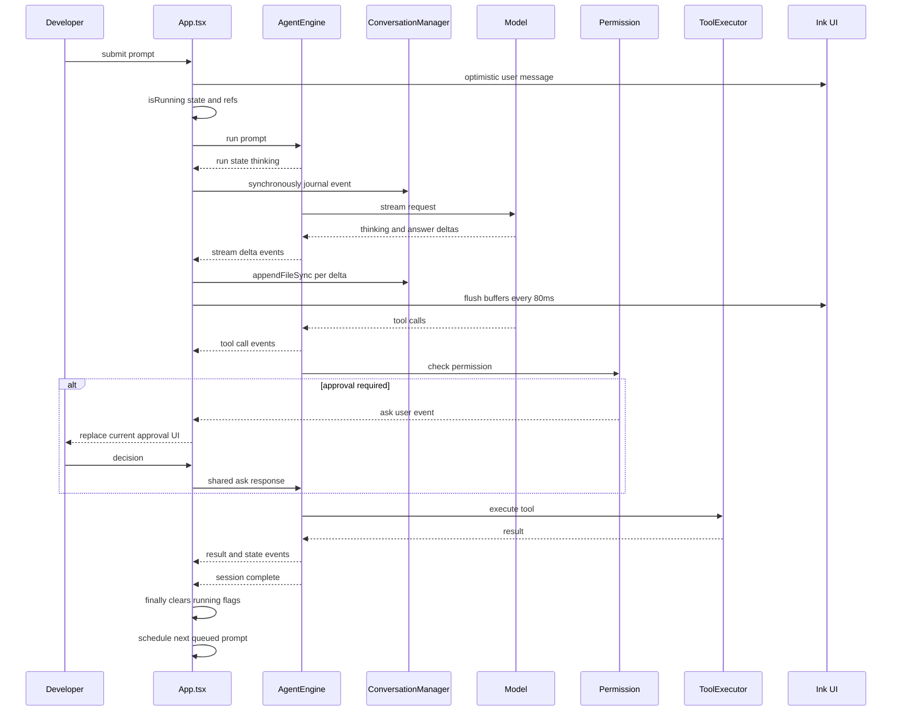
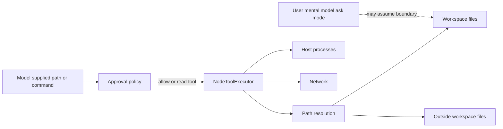
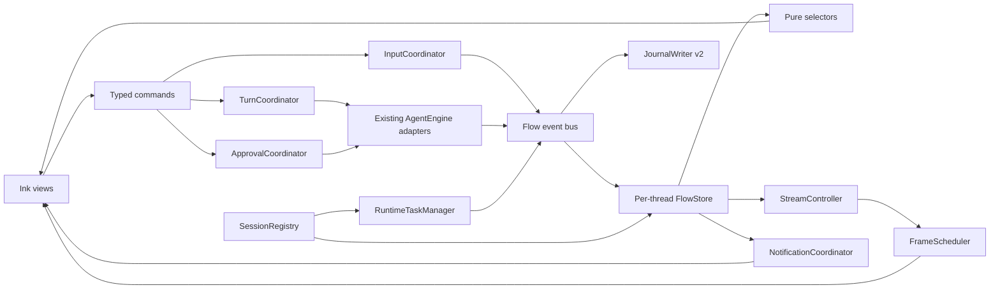
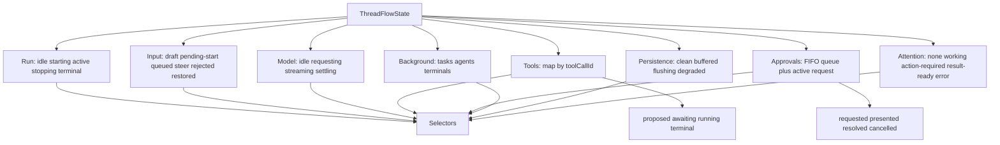

# TurboFlux 开发者心流工程蓝图

> 基于 Codex CLI 最新源码的 UI 状态流研究、TurboFlux 全链路审计与渐进式改造方案

## 0. 文档状态与审计基线

| 项目 | 基线 |
| --- | --- |
| 文档状态 | Implemented and verified；Flow 语义 UI、degraded recovery、平台注意力、分块回退和终端基线工具已接入；真实物理 paint 与发布周期证据仍按外部验收项管理 |
| 审计时间 | 2026-07-29，Asia/Shanghai |
| Codex 上游 | `https://github.com/openai/codex.git` |
| Codex 固定提交 | `8bbdf6c8f9ecf4833479c64a4794c9ed6c2dab9b` |
| Codex 提交时间 | 2026-07-28T19:58:25Z |
| Codex 提交标题 | `Use the shared HTTP client for TUI network checks (#35821)` |
| Codex 增量复核 | 从旧审计 SHA `4f6eaf7…` 到当前 SHA 只新增 OSS provider/update 网络检查改动；本文引用的输入、审批、通知、stream、resize 状态流文件未变化 |
| TurboFlux 固定提交 | `f13985ef719948d911bb748effa469bfbc4741a5` |
| TurboFlux 工作树 | 审计起点存在用户未提交修改；本轮 flow 改造的文件见实施报告，`promo-video` 等无关用户修改不归因于本轮 |
| 审计方式 | OpenVC `hybrid/audit`、`max` 细节，加上关键生命周期的人工逐函数追踪 |
| OpenVC 范围 | 最终扫描 284 个文件，未截断：`src` 272、`.turboflux/agents` 2、`scripts` 3、`docs` 7；根配置与 CI 另行人工复核 |
| 排除项 | `node_modules`、`dist`、`promo-video`、`benchmark-results` 和运行时生成目录 |
| TypeScript 规模 | 277 个 TS/TSX 文件、100 个测试文件、约 51,910 行（PowerShell `Measure-Object -Line`） |
| 热点文件 | `agentEngine.ts` 6,110 行；`App.tsx` 2,246 行；`nodeToolExecutor.ts` 2,397 行；`subAgent.ts` 1,833 行 |

### 0.1 结论可信度标记

本文严格区分三类陈述：

- **[事实]**：可由固定提交上的源码、测试或配置直接复核。
- **[推断]**：由多条源码事实推出的工程或体验影响；不是心理学因果证明。
- **[待验证]**：合理假设，但必须通过真实终端、负载、用户研究或遥测验证。

所有行号都是审计时快照。TurboFlux 工作树仍在变化时，应优先按符号名查找；Codex 引用使用固定 SHA 的永久链接。

### 0.2 审计边界

本次审计回答四个问题：

1. Codex CLI 如何组织输入、turn、工具、审批、线程和渲染状态？
2. 哪些机制减少了等待不确定性、焦点抢占和注意力残留？
3. TurboFlux 当前链路中，哪些状态竞争会破坏控制感、连续性或信任？
4. 如何在不重写整个 Runtime 的前提下，建立可迁移、可观测、可回滚的心流工程体系？

本次审计不包含：

- 对“进入心流”的医学、心理学保证；
- 对所有终端模拟器和操作系统的真实设备测试；
- 把结构性能基准直接等同于真实终端的 key-to-paint、submit-to-echo 或 delta-to-tail SLO；
- 对 Codex 内部设计目的的主观代言；本文只描述源码行为及其可解释影响；
- `promo-video`、既有侧栏视觉调整和其他用户工作树修改的设计归因或验收。

---

## 1. 执行摘要

### 1.1 总判断

**心流不能由 UI 保证，只能被工程系统支持。** 对开发者工具而言，最有价值的支持不是更炫的 spinner，而是持续满足以下条件：目标清楚、反馈及时、状态可信、控制可逆、打断可恢复、后台工作可追踪。

Codex CLI 的关键优势不是某个单独组件，而是一套相互配合的状态纪律：

- UI 意图与服务端事实分层；
- 每线程保存可回放状态，而不是只保存当前屏幕；
- 输入具有 queued、submitted-pending-start、pending-steer、rejected-steer、restored 等显式生命周期；
- 流式内容分为不可变 scrollback 与可变 tail；
- 帧请求合并，输出节奏根据 backlog 深度和年龄自适应；
- 审批会立即产生“需要行动”信号，但在用户刚输入后延迟抢占焦点；
- resize、paste burst、线程切换、非当前线程审批都被当作状态机问题处理。

TurboFlux 已具备很好的产品基础：乐观消息、运行中 steer、下一轮 queue、首响应前中断恢复、会话 JSONL 恢复、RuntimeTaskManager、TaskManager、后台终端、子代理、diff 和一组纯 UI selector。它不需要照搬 Codex，也不应先重写为 app-server。

以下是**改造前基线**中最需要修复的确定性与信任边界，不代表当前工作树仍保留这些缺陷：

| 优先级 | 结论 | 为什么先做 |
| --- | --- | --- |
| P0 | 并行工具审批共享单一 resolver，可能永久悬挂 | 会让用户批准后仍永远等待，是硬正确性问题 |
| P0（不可信内容场景） | 审批策略不等于 sandbox，当前允许工作区外路径 | 用户无法从“ask”推断真实能力边界，直接破坏信任 |
| P1 | Engine、React state/ref、流缓冲、queue 形成多重真相源 | race、误渲染、难恢复和难测试的共同根因 |
| P1 | steer/queue 缺少 accepted/rejected/committed 协议 | 输入可能静默消失，错误后 queued prompt 可能误执行 |
| P1 | 每个 delta 同步写 journal，长 transcript 全量渲染 | 热路径 I/O 和格式化会竞争按键反馈预算 |
| P1 | 会话、Runtime 与任务 owner 的身份不统一 | 切换会话后后台状态可能归属错误或混杂 |

本轮已完成上述 P0/P1 的主要工程闭环：并行审批改为 FIFO request registry，能力边界独立于审批策略，steer 拥有 accepted/committed/rejected/restored 协议，会话 identity 由 `SessionRegistry` 协调，journal 使用按 durability 分级的单写者，渲染和通知进入独立调度器；`AgentFlowController + FlowStore` 已接管 run、queue、approval、tool、stream、runtime、mode、usage、task 与 tool draft，现有 TUI 只通过 selectors 读取执行事实。后续又补齐失败批次保留、degraded 全局提交门禁、`/flow status|retry|export`、核心性能块 feature flags、终端焦点/桌面通知/reduced-motion、共享 resize 订阅、真实 ConPTY 四轮队列 smoke，以及 Windows/SSH 基线报告和外部 paint evidence 门禁。仍未完成的是 `App.tsx` 的物理拆分与真实设备 physical paint/通知送达矩阵。

### 1.2 已执行的架构决策

本轮采用渐进式的 **typed event + deterministic reducer + coordinators** 架构：

1. 定义带 `sessionId/threadId/runId/turnId/itemId/seq` 的 `FlowEventEnvelope`。
2. 每线程由纯 `flowReducer` 构造唯一可回放事实状态。
3. Flow 状态只通过 selectors 读取；phase/action/queue、输入回执与后台摘要已驱动现有 TUI，React 中平行的 Agent 执行状态已删除。
4. 将副作用拆给 `ApprovalCoordinator`、`ApprovalPresentationScheduler`、`ConversationJournalWriter`、`AdaptiveStreamScheduler` 与 `NotificationCoordinator`。
5. 由 `AgentFlowController` 把现有 AgentEvent 归一化进单一 FlowStore，不重写 AgentEngine，也不建立第二套副作用 owner。
6. 保留现有 Conversation journal、RuntimeTaskManager、TaskManager 和三组纯 selector，并迁移到新事件协议。

### 1.3 当前落地快照

| 领域 | 已实现 | 验证状态 |
| --- | --- | --- |
| 状态事实 | Flow event schema v2、per-thread reducer/store、selectors、AgentFlowController 单源接管 | 单元测试、ownership 防回退与 12 条 Golden Trace 已通过 |
| 审批与输入 | request-id FIFO、exactly-once settle、steer ack/restore、错误后 queue hold | 并行审批、abort、尾部 steer、恢复 trace 已通过 |
| 能力边界 | `read-only` / `workspace-write` / `danger-full-access`，canonical path gate | 绝对路径、`..`、symlink/junction、drive/UNC 测试已通过 |
| 持久化与身份 | JournalWriter v2、失败 entry retry、脱敏恢复包、degraded gate、v1/v2 双读、SessionRegistry | 损坏尾行、失败注入、retry/export、草稿/queue/审批恢复测试已通过 |
| 渲染与输入 | 自适应 scheduler、windowing、Markdown LRU、paste/IME、stdout flush tracker、独立回退 | 结构性能与 flush 逻辑测试已通过；真实物理 paint SLO 待目标终端采样 |
| 注意力系统 | modal 延迟、priority/dedupe inbox/title、focus reporting、固定类别桌面通知、reduced-motion | 逻辑与平台调用参数测试已通过；真实 OS 送达/勿扰矩阵待测 |
| 可观测性 | 无内容数值遥测、flush histogram、ANSI DSR probe、外部 paint schema、12 条 Golden Trace、双平台 CI | 本地门禁已通过；目标设备矩阵由 `baseline:terminal --strict` 收口 |

### 1.4 成功定义

改造成功不等于“看起来像 Codex”，而是以下不变量同时成立：

- 任一用户输入都有可查询的终态，永不静默丢失；
- 任一审批请求 exactly-once 结算，取消与崩溃也有终态；
- UI 显示的阶段与真实可执行阶段一致；
- 用户提交与审批决策在副作用发生前已耐久化；
- 10k 逻辑行 transcript 下，按键到 paint 的 p95 仍不超过 50ms；
- 当前线程和后台线程的“需要行动”不会混淆，也不会被短 TTL 吞掉；
- 所有迁移都可通过 feature flag 回退，journal 可前向读取、可安全降级。

---

## 2. 从“心流”到可工程化指标

### 2.1 不把心理状态伪装成产品 KPI

心流是一种主观状态。CLI 无法直接观测“用户进入了心流”，更不能把会话时长、token 数或工具调用数当成心流本身。本文只使用可验证的代理指标：交互延迟、状态不确定时长、焦点抢占次数、恢复成功率、静默输入丢失率、误通知率和用户主动重试率。

### 2.2 心理机制、工程机制与代理指标

| 心流支持条件 | 常见破坏方式 | 工程机制 | 可测代理指标 | 解释限制 |
| --- | --- | --- | --- | --- |
| 目标清楚 | spinner 只显示“Working” | 显示当前 objective、阶段、active tool、后台工作摘要 | 无语义状态时长；状态详情覆盖率 | 详情多不等于目标真清楚 |
| 反馈及时 | 按键、提交、delta 延迟 | 乐观输入、delta tail、合并重绘、输入优先调度 | key-to-paint、submit-to-echo、delta-to-tail | 低延迟不代表结果质量高 |
| 状态可信 | UI 与 Runtime 状态漂移 | 唯一 reducer、单调 seq、显式终态 | 状态矛盾次数；非法转移数 | 只能证明内部一致性 |
| 控制感 | stop、queue、steer 行为含糊 | accepted/rejected/committed、可恢复中断、可撤回 queue | 控制命令确认延迟；恢复率 | 控制多也可能增加复杂度 |
| 低注意力残留 | 审批突然覆盖输入，后台结果消失 | 输入空闲后再弹 modal、action inbox、每线程草稿 | modal 抢占率；未确认结果丢失率 | 需结合用户研究判断干扰感 |
| 连续性 | resize 重排、重启丢状态 | source-backed reflow、journal、per-thread state | resize 后内容一致率；崩溃恢复率 | 恢复正确不代表阅读舒适 |
| 安全感 | ask 模式却能越界读取 | capability boundary 与 approval policy 分离 | 越界未授权操作数；拒绝可解释率 | 安全策略仍需威胁模型评审 |
| 合理节奏 | 固定帧率或固定 flush 不适应 burst | backlog/age 自适应、迟滞、帧合并 | backlog age、dropped frame、CPU/paint | 阈值必须按真实环境校准 |

### 2.3 心流工程原则

1. **先正确，再流畅**：永久等待、输入丢失和能力越界优先于动画优化。
2. **事实先于展示**：所有文案、颜色、spinner 都必须由同一个事实状态派生。
3. **立即确认意图，异步确认事实**：提交后立即回显，但明确区分 pending、accepted、committed。
4. **阻塞必须可见，焦点不必立即抢走**：Action Required 可即时出现，modal 可等待输入空闲。
5. **完成必须有语义**：模型停止输出、turn 完成、目标完成、后台任务完成不是同一件事。
6. **每个等待都有 owner、原因和退出路径**：包括审批、模型、工具、journal、终端和子代理。
7. **可恢复性属于交互设计**：草稿、附件、queue、steer、审批和线程选择都应进入恢复模型。
8. **性能预算围绕用户输入**：输出动画可以降级，按键反馈不能被后台工作挤占。

---

## 3. Codex CLI：状态流参考架构

### 3.1 Context / container 架构



纯文本降级：终端事件、本地 `AppEvent`、线程事件与 app-server 事件统一进入 `App` 主循环；`App` 把每线程事实保存到 `ThreadEventStore`，`ChatWidget` 管理交互视图，流控制器将输出拆成稳定 scrollback 与可变 tail，`FrameRequester` 合并重绘请求。

#### 源码事实

- **[事实]** `app.rs` 的 `select!` 同时等待本地 app event、活跃线程事件、TUI event 和 app-server event；它是调度汇聚点，而不是让每个组件自行抢占终端。
- **[事实]** `AppEvent` 是 UI 进程内的意图/控制总线，包含历史插入、弹层、配置、线程与退出等操作。
- **[事实]** app-server 的 thread/turn/item 通知承载远端事实；TUI 会缓存和回放，而非把当前 React/Widget 外观当作事实源。
- **[事实]** `ThreadEventStore` 保存事件缓冲、未决交互重放状态、active turn、pending interrupt 与 composer 相关状态。
- **[推断]** 这种分层降低了“按钮已经按下，但服务端是否接受”之间的混淆，也让线程切换与恢复有稳定依据。

### 3.2 输入不是一个字符串，而是一条协议



纯文本降级：输入从草稿出发；空闲提交先进入“已提交、等待 turn 启动”，忙碌时可以排队或成为 pending steer；服务端提交事实后才进入 committed；拒绝、中断或启动失败会进入 rejected/restored 并返回编辑器。

#### 关键机制

- **乐观可见，事实对账**：app-server 的 `turn/start` 可能等待远端工作，所以 Codex 先把 prompt 排入 UI 事件队列，再发送远端请求。用户不必盯着空白界面猜测 Enter 是否生效。
- **显式 pending-start**：`user_turn_pending_start` 与“turn 已运行”分开，避免在远端尚未接受时错误提交下一条。
- **steer 有三段状态**：pending、committed、rejected。提交不是成功；只有服务端用户 item 与 compare key 对上才算 committed。
- **拒绝可恢复**：rejected steer、queued message、附件占位和当前 composer 可以按稳定顺序合并回编辑器。
- **队列一次只发一条**：turn 完成后 `maybe_send_next_queued_input()` 只启动一个新 turn，剩余内容继续排队。
- **线程拥有草稿**：切换线程时，composer 与 in-flight 输入状态跟随线程保存和恢复。

#### 对心流的作用

- **[推断]** 乐观回显减少提交后的不确定空窗。
- **[推断]** rejected steer 可恢复，降低“我刚才那句话去哪了”的注意力残留。
- **[推断]** 一次只 drain 一条，使下一轮目标仍可被用户观察和打断。
- **[待验证]** optimistic prompt 与最终 committed prompt 的视觉差异是否足够清楚，仍需真实用户测试。

### 3.3 流式渲染：稳定区与可变尾部



纯文本降级：delta 先进入源码收集器；未闭合内容暂存，稳定行进入提交队列，可能重排的表格等保留在可变 tail；稳定行只追加到 scrollback，tail 在活动 cell 中更新；最终以 canonical source 合并并重排。

#### 两区域模型

- **[事实]** `streaming/controller.rs` 明确定义 stable region 与 tail region。
- **[事实]** stable region 通过动画队列追加到 scrollback，中途不回写。
- **[事实]** tail 是 active-cell 中可变的临时 cell；表格 header 之后可被整体 hold back，因为新增行可能改变列宽。
- **[事实]** finalize 以累计的 canonical source 重新形成最终 cell，而不是拼接屏幕上已经换行的片段。
- **[推断]** 这避免长表格、Markdown 重排与终端 resize 造成历史内容“跳动”，保护阅读位置和空间记忆。

#### 自适应输出节奏

Codex 当前固定提交上的默认策略是：

| 变量 | 值 | 行为 |
| --- | ---: | --- |
| 进入 catch-up 的队列深度 | 8 行 | 达到即从 Smooth 切换到 CatchUp |
| 进入 catch-up 的最老行年龄 | 120ms | 达到即切换 |
| 退出候选深度 | ≤2 行 | 与年龄条件共同满足后开始 hold |
| 退出候选年龄 | ≤40ms | 与深度条件共同满足后开始 hold |
| 退出 hold | 250ms | 防止阈值附近抖动 |
| 重新进入抑制 | 250ms | 刚退出时避免立即重入 |
| 严重 backlog | 64 行或 300ms | 可绕过重入抑制 |

Smooth 每 tick drain 一行；CatchUp 会批量 drain 当前 backlog。阈值使用迟滞而非单一开关。

#### 帧调度

- **[事实]** `FrameRequester` 可被组件克隆并请求立即或延迟绘制。
- **[事实]** scheduler 将下次 deadline 之前的多个请求合并为一个 draw。
- **[事实]** 120 FPS 是最大上限，不是强制刷新目标。
- **[推断]** 合并重绘让动画和状态反馈保持流畅，同时不给重复 delta 重绘无限 CPU 权重。
- **[待验证]** TurboFlux 不应直接复制 120 FPS；Ink、Node、Windows Console 和不同终端的成本模型不同。

### 3.4 审批：阻塞立即可见，焦点延迟抢占

- **[事实]** `BottomPane` 保存 FIFO `delayed_approval_requests` 和 `last_composer_activity_at`。
- **[事实]** 用户最近输入后，审批 modal 等待 1 秒输入空闲；持续输入会重置 deadline。
- **[事实]** 延迟期间审批快捷键仍属于 composer，不会误提交审批决定。
- **[事实]** 到期后先展示最老请求，并保持剩余请求的 FIFO 顺序。
- **[事实]** Action Required 还可以通过终端 title 和通知表面显示，不需要等 modal 出现才知道被阻塞。
- **[推断]** 这是“可见性”和“抢焦点”的解耦：系统不隐藏阻塞，也不在用户输入半句话时劫持键盘。

### 3.5 通知是优先级系统，不是 toast 列表

- **[事实]** Codex 将 turn complete、exec/edit approval、elicitation、plan prompt 归类为不同通知。
- **[事实]** approval / prompt 的优先级高于 turn complete；低优先级通知不会覆盖已排队的高优先级通知。
- **[事实]** 通知支持按类型配置；完成通知会从响应中生成有限长度预览。
- **[事实]** terminal title 可显示 Action Required，并依据动画设置改变表现。
- **[推断]** 这减少“完成提示盖住审批提示”和离开终端后反复回来查看的成本。

### 3.6 resize、paste 与多线程不是边角问题

- **resize**：从 source-backed transcript cell 重建，而不是把已经 wrap 的终端行再次 wrap；流式期间的 resize 会在 consolidate 后修复。
- **Windows paste burst**：对缺少 bracketed paste 的终端识别快速字符流，避免 `?` 等字符触发快捷键，也避免 Enter 被误当提交。
- **IME**：paste heuristic 有长度、空白、时间窗和回退约束，防止短 IME burst 被误分类。
- **多线程**：每线程保留事件、active turn、未决审批/输入和 composer；非当前线程需要行动时仍能形成侧边状态和跳转入口。
- **回放**：已回答的交互请求不会在 thread replay 中重新出现。

### 3.7 Codex 机制如何支持开发者心流

| Codex 机制 | 减少的不确定性或打断 | 可能的心流作用 | 不应过度解读之处 |
| --- | --- | --- | --- |
| AppEvent + protocol facts | 意图与事实混淆 | 状态更可信、错误更可解释 | 架构复杂度本身不会产生心流 |
| per-thread event store | 切线程后状态丢失 | 支持并行目标与低成本返回 | 多线程也可能增加认知负担 |
| optimistic + pending-start | 提交后空白等待 | 即时反馈 | 必须清楚标识尚未被服务端接受 |
| pending/rejected steer | 输入静默丢失 | 保持控制感 | steer 语义仍依赖模型行为 |
| stable scrollback + tail | 内容跳动、阅读位置丢失 | 保持视觉连续性 | 动画过慢仍会令人烦躁 |
| adaptive chunking | burst 时显示落后 | 兼顾可读节奏与追赶 | 阈值不是跨技术栈常量 |
| delayed approval modal | 输入中途被抢焦点 | 减少注意力残留 | 高风险请求仍必须立即可见 |
| notification priority | 关键提醒被覆盖 | 离开终端仍有控制感 | 通知过多会反向打断 |
| source-backed reflow | resize 后内容损坏 | 保持空间记忆 | 仍需性能上限与降级 |

---

## 4. TurboFlux 当前架构与完整状态流

### 4.1 当前容器关系



纯文本降级：`App.tsx` 同时连接输入、AgentEngine、事件订阅、ConversationManager 和 UI；AgentEngine 再直接协调模型、权限、工具、Task 与子代理；Conversation 与 Runtime 各有独立 journal。

### 4.2 一次主运行的真实序列



纯文本降级：App 先乐观显示输入，再调用 Engine；Engine 发出状态、stream、tool 和完成事件；App 对每个事件先同步写会话 journal，再更新多组 React state/ref；审批通过单一 pending UI 与单一 Engine resolver 往返；finally 无条件尝试启动下一条 queue。

### 4.3 当前完整生命周期

1. `PromptInput` 提交文本与附件。
2. `handleSubmit()` 清空 editor；运行中且无附件时优先调用 `submitSteeringMessage()`，否则入下一轮 queue。
3. `runPrompt()` 立即 append 用户消息，并在校验 API key / model 后设置 `isRunning`、stream buffer、tools、Task、审批等 UI 状态。
4. `AgentEngine.run()` 建立 AbortController、清理 run grants、创建用户 turn，进入模型循环。
5. 模型事件被规范成 `AgentEventType`，但事件本身通常没有统一的 session/thread/run/turn/item/seq envelope。
6. App 的 `engine.subscribe()` 首先调用 `convManager.recordEvent(event)`，然后按事件类型写多个 React state 和 ref。
7. stream delta 先累积在 ref，80ms timer 再更新可见 state；journal 则每个 delta 直接同步追加。
8. 工具调用被划分为 concurrency-safe 并行批次与串行批次。
9. 权限检查可能 emit `ask:user`，Engine 等待共享 responder，App 只显示一个 `pendingAsk`。
10. 工具结果进入 Engine turns、TaskManager、App tool lifecycle 和 Conversation journal。
11. 无更多工具时 Engine 发 `session:complete` 和 `completed`，随后仍可能执行 context preparation 才释放 `currentRunPromise`。
12. App 的 `finally` 清空运行状态，并无条件调度 `runNextQueuedPrompt()`。
13. 中断发生在首个响应前时，App 会恢复 prompt、附件、旧 turns，并移除乐观消息；已有响应时保存 interrupted assistant。

### 4.4 当前状态所有权盘点

| 概念 | 当前 owner / 副本 | 问题 |
| --- | --- | --- |
| Engine 是否运行 | `currentRunPromise`、`AgentEngine.isRunning()` | 与 `runState.phase` 的时间边界不同 |
| 运行阶段 | `AgentEngine.runState`、App `runState` | 事件复制，App 可能落后一帧 |
| UI 是否运行 | App `isRunning`、`isRunningRef` | state/ref 手工同步，可产生瞬态差异 |
| 当前输入 | App state、`inputRef`、PromptInput 内状态 | 中断与异步 callback 需要手工对账 |
| 当前 prompt | `activePromptRef` | 不在 journal，仅进程内可恢复 |
| steer | Engine `pendingSteeringMessages: string[]` | 无 request ID、accepted/rejected/committed |
| 下一轮 queue | App state + `queuedPromptsRef` | 不耐久化；interrupt 会清空 |
| stream | Engine events、App 两个 buffer ref、两个 visible state | 多份内容与刷新时机 |
| 审批 | Engine 单一 resolver + queued response；App 单一 `pendingAsk` | 并发请求可覆盖；无队列事实 |
| 工具 | Engine turns、TaskManager、App current tools | 多个生命周期视图需手工同步 |
| 会话 ID | ConversationManager、Engine、StateProvider、Runtime owner | 创建和切换并非同一事务 |
| 子代理 | Engine / RuntimeTaskManager / App activity array | UI 完成态 6 秒后删除 |
| transcript | messages + stream state + viewport metrics | viewport 裁切位置，不裁剪 render tree |
| 持久化 | Conversation journal、Runtime journal、部分 config | draft、queue、steer、审批未统一进入 journal |

`App.tsx` 当前约出现 46 次 `useState`、34 次 `useRef`、17 次 `useEffect`、34 次 `useCallback`。数字本身不是缺陷，但它说明 App 已经同时承担 domain reducer、side-effect coordinator、persistence bridge、render scheduler 和视图组合器五种角色。

### 4.5 应保留并强化的优势

- **乐观输入**：用户提交后立即看到自己的消息。
- **steer 与 queue**：已经有“干预当前 run”和“排下一轮”的产品入口。
- **中断恢复**：首个响应前中断可恢复 prompt 与附件；已有部分结果时可形成 interrupted assistant。
- **Conversation JSONL**：能回放用户 turn、stream/thinking delta、tool call/result，修复截断尾行，并补齐未闭合工具调用。
- **RuntimeTaskManager journal**：运行任务有独立生命周期、日志与恢复语义。
- **TaskManager / 后台终端 / 子代理 / diff**：这些是 TurboFlux 的差异化资产，不应在 UI 重构中被替换。
- **纯 selector**：`developerFlowModel`、`agentActivityModel`、`toolLifecycleModel` 已经证明可以把复杂事件压缩为可测试的展示模型。

---

## 5. 风险与问题卡（P0–P3）

### F-001 · P0 · 并行审批可覆盖 resolver 并永久等待

**状态：已由源码链路确认；需要并发测试复现。**

**证据链：**

1. `AgentEngine` 只有一个 `pendingAskUserResolve`。
2. `executeToolsConcurrently()` 对 concurrency-safe 工具执行 `Promise.all()`。
3. MCP `readOnlyHint=true` 且非 open-world 时会被标为 concurrency-safe。
4. 非 `full` 策略下，所有 MCP 工具都要求显式审批。
5. 每个并行调用都会 emit `ask:user` 并调用 `waitForAskUserResponse()`。
6. App 只有一个 `pendingAsk`，后一个事件覆盖前一个显示。

**可能时序：**

```text
Tool A -> emit ask A -> pending resolver = resolveA -> UI pending = A
Tool B -> emit ask B -> pending resolver = resolveB -> UI pending = B
User approves B -> resolveB settles
Tool A -> resolveA 已失去引用，Promise 永久 pending
Promise.all -> 永久 pending，主 run 不结束
```

**心流影响 [推断]：** 用户已经作出决定却看不到进展，无法判断是网络慢、模型慢、审批未生效还是程序死锁；这是最强的控制感破坏之一。

**根因：** 审批被设计成“一个临时回调”，但执行器允许多个需要审批的 item 并发到达。UI scalar 与并发 domain 不匹配。

**修复：**

- 工具执行前做 approval preflight；未决工具不得先进入并发执行 Promise。
- 新建 FIFO `ApprovalCoordinator`，内部使用 `Map<requestId, Deferred<Decision>>`。
- UI 显示 active request，同时保留 queued requests 数量和来源。
- 所有 request 在 allow、deny、abort、thread close、runtime destroy、timeout 中 exactly-once settle。
- 允许后必须先 emit `approval.resolved`，再 emit `tool.running`。

**验收：**

- 两个并行 read-only MCP 请求可依次批准并全部完成。
- 任意批准顺序、拒绝、Ctrl+C、关闭进程都不会留下 unresolved Deferred。
- `approval_requests_total == approval_terminal_total`，且重复 terminal settlement 为 0。

### F-002 · P0（条件式）· approval policy 不是 capability boundary

**状态：当前行为由实现和测试明确要求；若产品只面向完全可信仓库，可降为 P1，否则是 P0。**

**事实：**

- `resolveAgainstWorkspace()` 接受绝对路径，relative path 也可通过 `..` 解析到 workspace 外。
- 测试明确要求支持 workspace 外读写。
- `ask` 默认只对变更、命令和外部动作等工具询问；普通 read tool 可以在策略允许时读取 workspace 外。
- permission pipeline 同时承担审批体验与部分风险规则，但没有形成文件系统/网络/进程的强制能力边界。



纯文本降级：模型提供的路径或命令先经过审批策略，再由 NodeToolExecutor 访问工作区、工作区外文件、主机进程或网络；当前“ask”只控制部分操作，不等于把能力限制在工作区内。

**心流影响 [推断]：** 开发者只有相信工具不会越过预期边界，才会减少持续监视。能力模型含糊会迫使用户保持警觉，无法把注意力交给任务本身。

**修复：** 将两个正交维度拆开：

| 维度 | 选项 | 负责什么 |
| --- | --- | --- |
| Capability profile | `read-only` / `workspace-write` / `danger-full-access` | 系统真正能触达什么 |
| Approval policy | `never` / `on-request` / `always-sensitive` | 在允许能力范围内何时询问 |

必须 canonicalize 路径并处理 symlink/junction、Windows drive、UNC、大小写和不存在目标的 parent realpath。所有外部路径都应显示规范化目标与授权范围。

**验收：**

- `workspace-write` 下，绝对路径、`..`、symlink、junction、跨盘符与 UNC 均不能逃逸。
- `danger-full-access` 才允许 workspace 外访问，并在状态栏持续可见。
- 审批“允许一次”不能扩大 capability profile。

### F-003 · P1 · 多重真相源导致非法组合状态

**事实：** Engine 有 `runState` 与 `currentRunPromise`；App 又有 `runState`、`isRunning`、`isRunningRef`、stream refs、`activePromptRef`、queue state/ref。事件没有统一 identity/sequence envelope。

**可出现的非法组合 [推断]：**

- `runState=completed`，但 `currentRunPromise` 仍非空；此时 steer 可以被接受，随后在收尾时清空。
- UI `isRunning=false`，但 Engine 正在 context preparation 或 runtime task 仍运行。
- `awaiting_approval` 已允许，真实工具已开始，侧边栏仍显示 Review Required。

**修复：** domain 状态只由 `FlowStore` reducer 写入；`isRunning`、`needsAction`、`canSteer`、`canQueue` 全部成为 selector。React state 只保留纯视图状态，如 hover、viewport、局部动画时钟。

### F-004 · P1 · 审批允许后仍停留在 awaiting_approval

**事实：** `checkToolPermission()` 设置 `awaiting_approval`，等待并解析 decision，允许时直接 `return null`；没有在执行真实工具前恢复 `tool_running`。

**影响 [推断]：** 用户点击允许后，UI 可能继续显示 Review Required，直到下一次模型循环或其他事件覆盖状态。系统正在做事，但界面仍声称等待用户。

**修复：** 将审批和工具 lifecycle 建模为不同正交状态；`approval.resolved(allow)` 后必须产生 `tool.queued` / `tool.running`。UI 的 `needsAction` 只由未决 approval/input selector 派生。

### F-005 · P1 · steer/queue 可能静默丢失或错误续跑

**事实：**

- steer 只是 `string[]`；`submitSteeringMessage()` 仅检查 `currentRunPromise`。
- Engine 发出 `completed` 后仍会做 context preparation，之后才清空 promise。
- pending steer 在 run 结束或 catch 中直接清空，没有 rejected/restored 状态。
- App 的 `finally` 不区分成功、recoverable error、abort，都会调度下一条 queue。
- Ctrl+C 会直接清空下一轮 queue。
- draft、queue、pending steer 均未进入 Conversation journal。

**影响 [推断]：** 用户输入可能已显示在 transcript，却没有进入模型；或前一轮发生错误后，下一条 prompt 在用户尚未检查错误时自动执行。

**修复：** 每条输入分配 `inputId`，至少经历 `created -> locally_durable -> submitted -> accepted|rejected -> committed|restored`。自动 drain 策略应为：

- `turn.succeeded`：只发送一条；
- `turn.failed_recoverable`：hold，等待用户 retry/discard/continue；
- `turn.interrupted`：恢复 pending steer 与 queue，不自动执行；
- `goal.auto_continuing`：不发送错误的完成通知，也不抢先 drain 用户 queue。

### F-006 · P1 · 同步 journal 写入模型热路径

**事实：** App 订阅每个 Engine event 时先调用 `recordEvent()`；stream delta 对应的 journal entry 最终使用 `appendFileSync()`。UI 虽按 80ms 合并 stream state，磁盘写入没有合并。

**影响 [推断]：** 高频 delta 会在 Node 主线程上执行 JSON stringify、open/append 等同步 I/O，与 Ink render、按键处理和 timer 竞争。

**修复：** 单写者 `JournalWriter`；关键事件立即 flush，delta 50–100ms 合并；队列过载时合并相邻同类 delta，绝不丢弃 terminal/approval/input 事件。

### F-007 · P1 · TranscriptViewport 并非真正 windowing

**事实：** viewport 测量完整 content 高度，并通过负 `top` 移动完整 children；`MessageList` 仍 map 所有消息，`AssistantMessage` 每次调用 Markdown 格式化。

**影响 [推断]：** 长会话中，活动状态、elapsed、delta 等高频变化可能让大量历史组件参与 reconciliation、测量或格式化，压缩按键延迟预算。

**修复：** 以 immutable cell 为单位虚拟化，维护 `cellId -> measuredHeight(width)` cache；只渲染可视窗口加 overscan；Markdown AST / formatted lines 按 source hash 与 width 缓存。

### F-008 · P1 · 已计算的语义状态在默认 UI 中不可见

**事实：**

- 默认 CLI 使用 fixed alternate-screen 模式。
- `SessionSidebar` 计算 `flow.label/detail/background`，当前只绘制 label。
- fixed 模式隐藏 `SubAgentProgressLine` 与 `TaskProgressLine`。
- 完成的子代理 activity 在 6 秒后从 App state 删除。

**影响 [推断]：** 系统已经知道“为什么在等、哪个后台代理完成、队列还有多少”，但默认界面只给出粗粒度标签；result-ready 可能在用户看到前消失。

**修复：** 将 `flow.detail` 作为当前前台动作，将 `flow.background` 作为压缩的一行后台摘要；结果进入需确认的 action/result inbox，而不是仅靠 6 秒 TTL。

### F-009 · P1 · 会话身份未形成原子切换

**事实：** 至少存在 ConversationManager `currentId`、Engine `session.id/config.conversationId`、StateProvider `conversationId`、RuntimeTask `ownerSessionId`。Runtime 在 App mount 时创建一次；ConversationManager 的 `startNew/switchTo` 只更新自己的 ID 并恢复 turns。

**影响 [推断]：** 新建或切换会话后，持久化会话、Engine state、后台任务 owner 和子代理 owner 可能代表不同身份，尤其在多会话后台任务并存时。

**修复：** `SessionRegistry.activate(threadId)` 成为唯一事务入口；先持久化旧线程，再更新 active identity，恢复新线程 store，最后发布 `thread.activated`。Runtime task owner 一经创建不可随 UI 切换改变。

### F-010 · P2 · 审批会立即替换输入焦点

App 在 `pendingAsk` 存在时隐藏普通 prompt 并直接显示审批节点，没有“最近输入后 1 秒空闲”的协调器。应立即显示 Action Required，但延迟 modal；高风险倒计时类请求可例外并明确说明。

### F-011 · P2 · 缺少统一通知优先级和终端外状态

审计范围内未找到面向主 UI 的终端 title 状态机、前后台感知、通知去重与优先级仲裁。已有 `notification` 事件更多表现为 transcript system message 或短 hint。应建立 `NotificationCoordinator`，避免完成提示覆盖审批/错误。

### F-012 · P2 · Windows 非 bracketed paste / IME 缺少 burst 状态机

`PromptInput` 主要依赖 Ink `usePaste`；审计范围内没有与 Codex 类似的快速字符 burst、Enter 抑制和回退机制。需要在 Windows Terminal、ConHost、SSH、tmux 和中文 IME 上实测后实现，不应仅复制时间常量。

### F-013 · P2 · pause/resume 是未接通能力

Engine 定义 `pause()` / `resume()` 与 `paused` phase，但 UI 未找到调用入口；CLI `/resume` 表示恢复历史会话，不是恢复当前 run。要么完成控制面与状态恢复，要么删除/隐藏未兑现的 pause 语义，避免 selector 展示不可操作状态。

### F-014 · P2 · Task 进度不等于目标完成度

现有任务进度与工具调用终态高度相关，Engine 还会在运行结束时 finalize orphaned leaves。它可表达执行完成比例，但不应文案化为“目标完成 99%”。建议区分 `executionProgress`、`objectiveConfidence` 和 `resultReady`；后两者不能从 tool ratio 伪造。

### F-015 · P2 · 固定 80ms flush 与固定 FPS 缺少负载反馈

默认 alternate screen 最大 24 FPS，stream UI 常用固定 80ms timer。低负载时可能不够即时，高 burst 时又无法快速追赶。应基于 queue depth、oldest age、paint cost 与 input activity 自适应，并带迟滞。

### F-016 · P2 · 缺少端到端状态流与性能门禁

仓库已有 79 个测试文件，但根目录没有 CI workflow；审计未发现覆盖真实 Ink 输入、两个并行审批、10k transcript、崩溃重放和 Windows paste burst 的完整矩阵。必须先建立 deterministic trace harness，再迁移状态。

### F-017 · P3 · 状态文案和动画需要数据驱动调优

**[待验证]** `Thinking / Working / Executing` 的理解差异、spinner 密度、完成状态停留时间、侧边栏信息量与 reduced-motion 偏好，需要任务测试和遥测。P3 不应在 P0/P1 前用大量视觉改动掩盖状态正确性。

### 5.1 风险总表

| ID | 优先级 | 失效模式 | 用户可见症状 | 推荐 owner |
| --- | --- | --- | --- | --- |
| F-001 | P0 | 并行审批 resolver 覆盖 | 批准后永久等待 | Runtime / Permissions |
| F-002 | P0 条件式 | 能力越过预期边界 | ask 模式仍可读写外部路径 | Security / Runtime |
| F-003 | P1 | 多重真相源 | 状态矛盾、race | Architecture |
| F-004 | P1 | approval phase 不复位 | 工具运行时仍显示 Review | Runtime / UI |
| F-005 | P1 | steer/queue 无协议 | 输入消失、错误后误续跑 | Input / Runtime |
| F-006 | P1 | delta 同步落盘 | 输入与渲染卡顿 | Persistence |
| F-007 | P1 | transcript 全量 render | 长会话延迟上升 | UI Performance |
| F-008 | P1 | 语义状态未呈现 | 后台结果与细节不可见 | Product UI |
| F-009 | P1 | 会话身份漂移 | 任务归属/恢复混乱 | Runtime / Persistence |
| F-010 | P2 | 审批抢焦点 | 半句输入被中断 | Interaction |
| F-011 | P2 | 通知无仲裁 | 错过阻塞或被噪声打断 | Interaction |
| F-012 | P2 | paste burst 未建模 | 粘贴误提交/误快捷键 | Input |
| F-013 | P2 | pause 能力悬空 | 状态存在但不可操作 | Runtime / UI |
| F-014 | P2 | 进度语义混用 | 99% 卡住或虚假完成 | Task System |
| F-015 | P2 | 固定节奏 | 低负载迟钝、高负载落后 | UI Performance |
| F-016 | P2 | 缺状态流门禁 | race 回归无法提前发现 | Quality |
| F-017 | P3 | 视觉调优无数据 | 美化但不减中断 | Product Research |

---

## 6. Codex 与 TurboFlux 差距矩阵

| 能力 | Codex 当前机制 | TurboFlux 当前机制 | 差距 | 决策 |
| --- | --- | --- | --- | --- |
| 事实源 | app-server thread/turn/item + TUI cache | Engine event + 多组 React state/ref | 缺统一 identity/seq/reducer | 建 `FlowEventEnvelope` 与 per-thread store |
| 主循环 | `select!` 汇聚多来源事件 | Engine callback 直接驱动 App | App 承担过多副作用 | coordinator + store |
| 输入提交 | optimistic + pending-start + commit 对账 | optimistic + `engine.run()` | 无 accepted/committed | 引入 input lifecycle |
| steer | pending/rejected/committed/restore | `string[]`，run 末清空 | 可静默丢失 | request ID + ack/restore |
| queue | per-thread、一次 drain 一条 | App state/ref，finally 自动 drain | 错误策略与恢复缺失 | 按终态策略 drain，持久化 |
| 审批 | FIFO、多请求、线程感知、延迟 modal | 单 resolver + 单 pending UI | 并发死锁风险 | ApprovalCoordinator |
| capability | sandbox/approval 语义分离 | permission pipeline + host executor | 边界含糊 | capability profiles |
| streaming | stable region + mutable tail | 完整 stream string state | 历史重复格式化与跳动风险 | committed cells + tail |
| 节奏 | backlog depth/age + hysteresis | 80ms flush + fixed max FPS | 不自适应 | StreamController + FrameScheduler |
| resize | canonical source replay/reflow | Ink 全树重新布局 | 长历史成本高 | source cache + windowing |
| transcript | committed cells + live active cell | messages map + top offset | 非真正虚拟化 | cell virtualization |
| paste | Windows burst/IME 状态机 | Ink `usePaste` | 终端兼容缺口 | 平台 trace 驱动实现 |
| 通知 | priority、配置、title、桌面通知 | hint/system message | 阻塞与完成混杂 | NotificationCoordinator |
| 多线程 | per-thread store/draft/approval | Conversation turns 恢复 | Runtime owner 未同步 | SessionRegistry + ThreadFlowState |
| 持久化 | 事件回放与线程事实 | Conversation/Runtime 两套 JSONL | UI domain 状态缺失；delta 同步写 | JournalWriter v2 |
| 测试 | 大量状态与快照测试 | 单元测试较丰富 | 缺 golden trace/perf/E2E | trace harness + CI |

---

## 7. 目标架构

### 7.1 目标容器



纯文本降级：UI 只发送 typed command；输入、turn、审批协调器执行副作用并发布统一事件；每线程 FlowStore 和 JournalWriter 同时消费事件；selector 驱动 UI，stream/frame 模块控制绘制；SessionRegistry 统一身份，NotificationCoordinator 只读取事实状态。

### 7.2 `FlowEventEnvelope`

建议新增 `src/shared/flowEvents.ts`：

```ts
export interface FlowEventEnvelope<T extends FlowEventPayload = FlowEventPayload> {
  schemaVersion: 2
  eventId: string
  sessionId: string
  threadId: string
  runId?: string
  turnId?: string
  itemId?: string
  seq: number
  at: number
  type: T['type']
  payload: Omit<T, 'type'>
}
```

协议约束：

- `seq` 在每个 `threadId` 内严格单调；reducer 对重复 `eventId` 幂等。
- `runId` 表示一次主执行，`turnId` 表示模型/用户 turn，`itemId` 表示输入、工具、审批、stream cell 等最小实体。
- request/response 使用同一个 `itemId` 或显式 `requestId`，不得依赖“当前唯一请求”。
- terminal event 不可被非 terminal event 逆转；重复 terminal 事件记录 invariant violation，但不重复副作用。
- `at` 用于体验指标，排序只依赖 `seq`，避免系统时钟回拨改变事实顺序。
- payload 必须是 discriminated union，不使用 `any` 或开放字符串状态。

建议第一批事件：

```text
thread.created / thread.activated / thread.archived
input.draft_changed / input.submitted / input.durable
input.accepted / input.rejected / input.committed / input.restored
input.queued / input.dequeue_requested / input.steer_requested
run.started / run.stopping / run.completed / run.failed / run.interrupted
turn.started / turn.completed / turn.failed
stream.started / stream.delta / stream.committed / stream.ended
tool.proposed / tool.awaiting_approval / tool.queued / tool.running
tool.completed / tool.failed / tool.cancelled
approval.requested / approval.presented / approval.resolved / approval.cancelled
runtime.started / runtime.progress / runtime.completed / runtime.failed
notification.raised / notification.acknowledged
journal.flush_started / journal.flushed / journal.degraded
```

### 7.3 正交状态机

不要继续把所有状态压成一个 `runState.phase`。目标 store 应维护正交维度，再由 selector 组合用户可见状态。



纯文本降级：每线程状态并行维护 run、input、model、tool map、approval queue、后台任务、持久化和注意力八个维度；selector 组合这些事实生成 UI 文案与可用操作，而不是用单一 phase 覆盖所有含义。

关键 selector：

```text
selectIsForegroundBusy
selectCanSubmitNow
selectCanSteer
selectCanInterrupt
selectNeedsAction
selectPrimaryActivity
selectBackgroundSummary
selectNextQueuedInput
selectUnacknowledgedResults
selectPersistenceHealth
selectTerminalTitle
```

### 7.4 状态所有权表

| 状态 | 唯一写入者 | 持久化 | UI 访问方式 | 禁止项 |
| --- | --- | --- | --- | --- |
| active thread/session identity | `SessionRegistry` | 是 | selector | App 自行拼 ID |
| run/turn/item facts | `flowReducer` | 是 | `useSyncExternalStore` | `setIsRunning` 写 domain state |
| draft/queue/steer | `InputCoordinator` + reducer | 是 | input selectors | state/ref 双写 |
| approval queue | `ApprovalCoordinator` + reducer | 是 | approval selectors | 单一 callback resolver |
| tool lifecycle | reducer | 是 | tool selectors | UI 猜测 running/done |
| Runtime tasks | `RuntimeTaskManager` | 已有 journal，事件桥接 | runtime selectors | 切会话时改 owner |
| immutable transcript cells | reducer / transcript projector | 是 | virtualized viewport | delta 重算全部历史 |
| mutable stream tail | `StreamController` | delta 批量 journal | tail selector | 写回已 committed cell |
| journal health | `JournalWriter` | 自描述 | health selector | 吞掉写入错误 |
| modal/hover/cursor animation | React view | 否 | 本地 state | 反向决定 domain 状态 |

### 7.5 TurnCoordinator

职责：

- 校验当前线程是否允许开始新 run；
- 为 run/turn 分配 ID，先耐久化 `input.submitted`，再启动模型副作用；
- 将旧 `AgentEventType` 适配为 envelope，并在迁移期同时投递 legacy UI；
- 明确 run terminal 原因：succeeded、failed-recoverable、failed-fatal、interrupted、cancelled；
- 只有 terminal event 才释放 run slot；context preparation 若仍属于 run，必须显示为 settling，若不属于则移到后台 maintenance task；
- 根据终态调用 InputCoordinator 的 queue policy；
- 避免 goal 自动继续时发送虚假“完成”通知。

### 7.6 ApprovalCoordinator

推荐接口：

```ts
request(input: ApprovalRequest, signal: AbortSignal): Promise<ApprovalDecision>
resolve(requestId: string, decision: ApprovalDecision): boolean
cancel(requestId: string, reason: ApprovalCancelReason): boolean
cancelRun(runId: string, reason: ApprovalCancelReason): number
snapshot(threadId: string): ApprovalSnapshot
```

实现不变量：

1. request 入 `Map<requestId, Deferred>` 前检查 ID 唯一。
2. `approval.requested` 必须先写 journal，再向 UI 宣告可决策。
3. 展示队列是 FIFO；可以按同一 server/capability 显式批量批准，但每个 request 仍单独结算。
4. UI decision 必须携带 requestId，不能把裸字符串交给“当前 resolver”。
5. `resolve()` 使用 compare-and-set，只允许 pending -> terminal 一次。
6. abort、destroy、thread close、timeout 都走同一个 settlement path。
7. allow 后先发布 resolved，再将对应 tool 变为 queued/running。
8. 审批 modal 延迟不影响顶部/terminal title 的即时 Action Required。

执行前 preflight：

```text
model tool batch
  -> validate all tool inputs
  -> capability check
  -> compute approval requirements
  -> enqueue and settle approvals
  -> construct executable approved batch
  -> parallelize only after approval settlement
```

这样不会让多个 Promise 在执行中途各自等待同一个 UI 通道。

### 7.7 InputCoordinator

每条用户输入是实体，不是字符串：

```ts
interface InputItem {
  id: string
  threadId: string
  text: string
  attachments: AttachmentRef[]
  intent: 'turn' | 'steer' | 'queued-turn'
  state: 'draft' | 'durable' | 'submitted' | 'accepted' |
    'rejected' | 'committed' | 'restored' | 'cancelled'
  createdAt: number
  updatedAt: number
}
```

策略：

- Enter 后立即绘制 pending cell，写 journal 成功后才允许发模型请求。
- active run 中无附件的普通文本可请求 steer；Coordinator 必须等待 accepted/rejected ack。
- run 已进入 terminal/settling gate 时，不再接受 steer，原文进入 rejected 并恢复到 composer 或显式转 queue。
- queue 可编辑、删除、重排；任何变化都进入 journal。
- `failed-recoverable` 不自动 drain；UI 提供 Retry current、Run next、Restore to editor。
- 中断时 pending-start 与未 committed steer 恢复；已 committed 内容留在 transcript。
- 每线程单独保存 draft、附件、queue、pending steer 和 selection。

### 7.8 渲染架构

#### Committed cells + mutable tail

- `TranscriptProjector` 将 terminal domain events 投影为 immutable cells。
- committed cell 一经写入，只能通过显式 correction event 替换，不能被 delta 原地修改。
- 当前 answer、未闭合 Markdown 与可重排表格进入 `MutableTail`。
- finalize 从 canonical Markdown source 构建最终 cell，并原子替换 tail。
- tool group 可拥有自己的 active cell，但必须以 `itemId` 与事实 lifecycle 对账。

#### 真正 windowing

- cell 级索引：`cellId`, source hash, estimated height, measured height by width。
- 可视区只 mount viewport + 上下各 1–2 屏 overscan。
- Markdown parse 结果按 source hash 缓存；wrap 结果按 `(sourceHash, width)` 缓存。
- resize 只使对应 width cache 失效，从 canonical source 重算可见 cells；后台分批修正高度。
- 用户不在底部时保持 anchor cell + offset，不因新 delta 强制跳底。

#### 自适应 StreamController

首版可把 Codex 的 `8 lines / 120ms` 当实验起点，不当常量真理：

- 输入：queue depth、oldest delta age、last paint cost、terminal width、用户是否正在输入。
- Smooth：小批量输出，优化可读性。
- CatchUp：backlog 超阈值时批量追赶。
- Input priority：检测到 key event 时，暂停非必要动画一个 frame，先处理输入与 cursor。
- Hysteresis：进入阈值高于退出阈值，避免模式抖动。
- Degrade：paint p95 超预算时关闭 shimmer/逐行动画，但不延迟文字可见性。

### 7.9 JournalWriter v2

#### 三类耐久级别

| 级别 | 事件 | 写入策略 | 崩溃损失预算 |
| --- | --- | --- | ---: |
| Critical | 用户提交、审批决定、capability change | append + flush；副作用前完成 | 0 |
| Terminal | tool/run/runtime 终态、queue 删除 | 立即 enqueue，高优先 flush | 0 |
| Streaming | answer/thinking delta、progress | 50–100ms 合并，最长 250ms flush | ≤250ms |

注意：乐观 cell 可以在 50ms 内显示，但模型请求必须等待 critical record durable；“显示确认”和“副作用门禁”是两个时点。

#### 单写者规则

- 一个 writer 持有文件句柄和 seq 分配，不让 UI callback 直接 `appendFileSync`。
- 相邻同 run/item 的 delta 可合并；critical/terminal 事件不可合并或丢弃。
- 写入失败发布 `journal.degraded`，阻止新的有副作用操作，并允许用户导出/重试；不得静默继续。
- v2 reader 跳过损坏尾行，验证 schema、seq 单调与 terminal invariants。
- snapshot 只是压缩，不替代 journal 事实；压缩必须使用 temp + atomic rename，并保留回滚点。
- Conversation journal 与 Runtime journal 可继续物理分离，但共享 identity 和 envelope 规范。

### 7.10 NotificationCoordinator

优先级建议：

```text
P0 action-required / fatal safety
P1 recoverable error / runtime failed
P2 result-ready / turn complete
P3 progress / informational
```

规则：

- inline status 始终可用；terminal title 用于离开当前 pane 的轻量提醒；桌面通知只在 terminal 不活跃或配置允许时发出。
- 相同 `itemId + type` 去重；高优先级不能被低优先级覆盖。
- active thread 的普通完成不必打断；非 active thread 的 approval/result-ready 应进入 inbox。
- 如果 queue 或 goal 自动继续，不能发“全部完成”；应显示“下一轮已开始”或“目标继续中”。
- reduced motion 下使用静态 title，不闪烁；提供通知类别开关。

### 7.11 子代理与后台任务

- RuntimeTaskManager 继续作为后台任务事实源。
- 每个子代理 task 必须有稳定 `threadId/runId/parentItemId/ownerSessionId`。
- “running” 可以压缩为背景摘要；“failed / result-ready / approval” 必须进入持久 inbox，直到 acknowledged。
- 不再以 6 秒 TTL 删除唯一完成信号；TTL 只能控制临时动画，不能删除事实。
- 非当前线程需要行动时，顶部显示来源和跳转键；切换后恢复该线程草稿与审批 modal。
- Task progress 只描述执行树，不声称目标质量；完成结果由 terminal event 和用户确认分别表达。

### 7.12 Capability boundary

建议 profile：

| Profile | 文件读取 | 文件写入 | 命令 | 网络 | 外部路径 |
| --- | --- | --- | --- | --- | --- |
| `read-only` | workspace | 禁止 | 仅安全只读且可关闭 | 默认禁止/白名单 | 需单独授权 |
| `workspace-write` | workspace | workspace | sandbox 内，按策略审批 | 按 host policy | 禁止 |
| `danger-full-access` | host | host | host | policy 控制 | 允许且持续可见 |

实现顺序：canonical path library -> filesystem gate -> command cwd/env gate -> network gate -> UI preset。不要先只改菜单文案。

---

## 8. SLO、延迟预算与遥测

### 8.1 用户体验 SLO

| SLO | 目标 | 起点 | 终点 | 备注 |
| --- | ---: | --- | --- | --- |
| 按键到 paint | p95 ≤50ms，p99 ≤100ms | input event received | frame committed | 10k 逻辑行 transcript 也适用 |
| submit 到乐观确认 | p95 ≤50ms | Enter | pending user cell painted | 不等于服务端 accepted |
| submit 到 durable | p95 ≤100ms，p99 ≤250ms | Enter | critical journal flushed | 模型副作用门禁 |
| delta 到可见 tail | p95 ≤100ms | delta received | tail frame committed | backlog 时看 oldest age |
| interrupt 到 Stopping | p95 ≤100ms | Ctrl+C | stopping visible | 进程真正终止另设 SLO |
| approval action signal | ≤250ms | request received | inline/title visible | modal 可延迟至输入空闲 1s |
| 非活动终端通知 | ≤1s | actionable/terminal event | notification posted | 需去重 |
| queue 操作确认 | p95 ≤100ms | edit/remove/reorder | durable + visible | 不允许静默失败 |
| stream 崩溃损失 | ≤250ms | last durable delta | crash | critical/terminal 为 0 |

### 8.2 正确性 SLO

| 不变量 | 目标 |
| --- | ---: |
| approval request exactly-once terminal settlement | 100% |
| tool call exactly-once terminal settlement | 100% |
| input accepted/rejected/committed/restored 可追踪 | 100% |
| queue/draft/rejected steer 恢复成功 | 100% |
| 未授权 workspace escape | 0 |
| reducer 非法状态转移 | 0；发现即测试失败并记录 |
| 错误“全部完成”通知 | 0 |
| journal seq 回退或重复副作用 | 0 |

### 8.3 渲染预算

以 50ms key-to-paint SLO 倒推主线程预算：

```text
input decode and routing       <= 5ms p95
command/reducer dispatch       <= 5ms p95
selector recompute             <= 5ms p95
visible tree reconcile         <= 15ms p95
terminal render/write          <= 15ms p95
scheduler and queue slack       5ms
```

这不是每帧都必须用满的配额。journal、Markdown parse、历史测量、日志压缩和 telemetry export 不应同步占用输入路径。

### 8.4 Telemetry schema

默认只记录结构化时序与计数，不记录 prompt、模型答案、命令全文、文件内容或绝对路径。路径可记录 workspace-relative category 或带本地 salt 的 hash。

```ts
interface FlowMetricEvent {
  schemaVersion: 1
  name: string
  at: number
  sessionHash: string
  threadHash: string
  runId?: string
  itemId?: string
  seq?: number
  durationMs?: number
  queueDepth?: number
  oldestAgeMs?: number
  terminal?: string
  outcome?: string
  platform: string
  terminalFamily?: string
  appVersion: string
  featureFlags: string[]
}
```

核心事件：

```text
ui.key_received / ui.frame_committed
input.submitted / input.durable / input.accepted / input.rejected
stream.delta_received / stream.tail_painted / stream.backlog_sampled
approval.requested / approval.presented / approval.settled
tool.started / tool.settled
run.started / run.settled
journal.flush / journal.failure / journal.queue_depth
transcript.render / transcript.cache_hit / transcript.visible_cells
notification.raised / notification.posted / notification.acknowledged
invariant.violation / flow.reducer_violation
```

派生指标：

- `key_to_paint_ms = ui.frame_committed - ui.key_received`
- `delta_to_tail_ms = stream.tail_painted - stream.delta_received`
- `approval_wait_user_ms` 与 `approval_wait_system_ms` 分开统计；前者不是性能回归。
- `uncertain_state_ms`：无法由 selector 确定 primary activity 的时长。
- `attention_interruptions_per_run`：modal、桌面通知和强制跳转次数。
- `input_recovery_rate`：rejected/interrupted input 最终 restored 或 explicitly cancelled 的比例。
- `silent_loss_guard`：存在 submitted input 却没有任一 terminal input event 时报警。

隐私与治理：

- telemetry 默认本地聚合、可关闭；远程上报需单独 opt-in。
- debug trace 可包含更多字段，但必须显式启用并显示敏感数据警告。
- 保留周期、采样率和删除命令写入产品文档。
- 不用“会话更长”“工具更多”替代心流指标。

---

## 9. 测试策略与 Golden Traces

### 9.1 测试分层

| 层级 | 目标 | 工具 |
| --- | --- | --- |
| Reducer unit | 每个事件转移与 selector | Vitest table tests |
| Property-based | seq、幂等、terminal 不可逆、exactly-once | fast-check 或自建 deterministic generator |
| Coordinator concurrency | abort、审批、queue、steer race | fake clock + Deferred harness |
| Journal replay | 截断、重复、乱序、v1/v2、crash point | fixture + fault injection |
| Render unit | cell projection、window、anchor、tail finalize | Ink test renderer |
| Performance | 10k 行、burst delta、resize、输入优先 | benchmark + threshold gate |
| Terminal integration | Windows paste、IME、SIGINT、title | PTY/ConPTY test matrix |
| End-to-end trace | 输入到模型/工具/恢复完整链路 | fake model + fake executor + golden events |

### 9.2 必须建立的 Golden Traces

| # | Trace | 关键断言 |
| ---: | --- | --- |
| 1 | 纯文本回答 | input durable -> run start -> stream -> committed cell -> run success；无 orphan item |
| 2 | 写文件审批 | request durable；allow 后立即 tool running；一次终态 |
| 3 | 两个并行 read-only MCP 审批 | FIFO 展示；两个 Deferred 均结算；Promise.all 完成 |
| 4 | streaming 中 steer | steer accepted 后 committed；不重复显示 user cell |
| 5 | turn 尾部 steer race | terminal gate 拒绝 steer；原文恢复或显式入 queue |
| 6 | recoverable error + queued input | queue 保持 hold，不自动执行；用户可选择下一步 |
| 7 | 首 token 前中断 | prompt 与附件完整恢复；乐观 cell 回滚；无重复 turn |
| 8 | tool 中途崩溃恢复 | 未闭合 tool 形成 interrupted/cancelled terminal result |
| 9 | 长表格 streaming + resize | committed prefix 不变；tail 可重排；final source 一致 |
| 10 | 非当前 subagent 审批 | 当前输入不丢；Action Required 指明来源；可跳转 |
| 11 | 10k 行 transcript 性能 | key-to-paint p95 ≤50ms；mounted cells 有上限 |
| 12 | Windows paste burst / 中文 IME | Enter 不误提交；快捷键字符不误触发；无字符丢失 |

### 9.3 并发与故障注入矩阵

至少在以下时间点注入 abort/crash：

- input 显示后、critical journal flush 前；
- journal flush 后、模型请求前；
- approval requested 后、presented 前；
- 用户 decision 后、tool running 前；
- tool side effect 后、terminal result journal 前；
- stream delta 收到后、批量 flush 前；
- run completed 后、queue drain 前；
- thread switch 的旧状态 flush 与新状态 restore 之间。

每个点都验证：重启后没有重复副作用、没有孤儿 pending、用户输入有可解释终态。

### 9.4 性能门禁

CI 至少输出：

- 1k / 5k / 10k 逻辑行下 key-to-paint p50/p95/p99；
- 10、100、1000 delta/s 下 backlog oldest age；
- resize 80↔160 columns 的可见 cell 重算耗时；
- journal 1/10/100KB/s 下主线程 stall；
- mounted cell 数、Markdown cache hit rate、frame coalescing ratio；
- Windows 与 Linux 的独立基线，避免用一套绝对数字误判。

---

## 10. 渐进式迁移与回滚

### 10.1 推荐模块边界

```text
src/shared/flowEvents.ts
src/core/runtime/turnCoordinator.ts
src/core/runtime/approvalCoordinator.ts
src/core/runtime/inputCoordinator.ts
src/cli/state/flowStore.ts
src/cli/state/flowReducer.ts
src/cli/state/flowSelectors.ts
src/cli/conversations/journalWriter.ts
src/cli/rendering/streamController.ts
src/cli/rendering/frameScheduler.ts
src/cli/rendering/transcriptProjector.ts
src/cli/notifications/notificationCoordinator.ts
```

### 10.2 Feature flags

```text
TURBOFLUX_FLOW=0                         # 同时回退全部可逆 Flow 展示/性能块
TURBOFLUX_FLOW_UI=0                      # 关闭增强 Flow 语义展示，事实源仍为 FlowStore
TURBOFLUX_FLOW_WINDOWING=0               # WindowedMessageList -> MessageList
TURBOFLUX_FLOW_NOTIFICATIONS=0           # inbox/title/desktop notification -> inline legacy 状态
TURBOFLUX_FLOW_STREAM_SCHEDULER=0        # adaptive batch -> immediate visible update
TURBOFLUX_FLOW_JOURNAL_BATCHING=0        # streaming batch -> 同一 writer 即时写
TURBOFLUX_DESKTOP_NOTIFICATIONS=0        # 只关闭 OS 桌面通知
```

Flag 在 session start 固定，避免同一 run 中途切换展示或调度策略。Agent 执行事实始终由 FlowStore 持有；approval、input、capability 与 journal safety gate 不提供运行时关闭开关，因为它们是正确性/安全边界；关闭 batching 仍由同一 writer 持久化，不建立第二个副作用 owner。

### 10.3 AgentFlowController 单源接管（已完成）

1. AgentEngine 保持模型、工具与审批副作用 owner，不复制执行路径。
2. AgentFlowController 把 AgentEvent 归一化为带稳定 identity 的 FlowEvent。
3. FlowStore/reducer 持有每线程 run、input、approval、tool、stream、runtime 与 usage 事实。
4. React 只读取 selectors，不再持有平行的 `isRunning`、queue、mode、usage、task 或 tool draft 状态。
5. ownership test、controller test、Golden Trace 与真实 ConPTY queue smoke 共同防止双真相源回归。

### 10.4 Journal v2 迁移

- reader 同时支持 v1 和 v2；v1 数据在内存投影成 v2 state。
- 开始 v2 session 时写 migration boundary，不原地重写旧 journal。
- dual-write 只用于验证 durability，不用于触发两套 replay side effect。
- v2 snapshot 包含最后 seq 和 source journal ID；回退到 legacy 时保留 v2 文件，不删除。
- 若 v2 writer degraded，停止新的有副作用操作，允许安全导出、retry 或切回只读模式。

### 10.5 UI 分块切换顺序

1. 状态栏 selectors；
2. approval surface；
3. queue/steer surface；
4. committed transcript projector；
5. mutable tail 与 frame scheduler；
6. per-thread inbox 与通知；
7. 移除 React 中平行的 Agent 执行 state/ref，并用 ownership test 固化边界。

每一步保持旧 surface 可通过 flag 恢复。不要在同一个 PR 中同时迁移状态源、改布局和重写 Markdown renderer。

---

## 11. 30 / 60 / 90 天路线图

> 实施记录：本轮把原路线图压缩为一次工程落地。WP1–WP16 的代码与自动化门禁已完成，其中 WP13 已包含桌面通知、焦点检测和 reduced-motion；真实终端物理 paint/通知送达仍需设备证据。WP17 用户研究和 WP18 legacy 清理明确延期。下列时间段继续作为后续治理顺序，而不是声称所有外部退出条件已经满足。

### 0–30 天：正确性与可观测性

**目标：先消除永久等待、静默输入和身份漂移。**

| 工作包 | 产出 | 验收 |
| --- | --- | --- |
| WP1 Event contract | `FlowEventEnvelope`、ID/seq factory、schema tests | 重复/乱序/缺 ID 被测试捕获 |
| WP2 Approval safety | preflight + ApprovalCoordinator + Golden Trace #3 | 并行审批、abort、destroy 全结算 |
| WP3 Capability ADR | profile threat model、canonical path gate 设计 | Windows path/symlink 测试先落地 |
| WP4 Input protocol | input IDs、steer ack、queue terminal policy | Trace #4–#7 通过 |
| WP5 Session identity | SessionRegistry 与 owner invariants | switch/new/restart 不混 owner |
| WP6 Baseline telemetry | key/delta/approval/journal 本地指标 | 生成首份基线报告 |
| WP7 CI | type-check、unit、golden trace、diff check | main 分支有强制门禁 |

退出条件：F-001 关闭；F-005 的静默丢失路径关闭；所有审批/输入都有 terminal trace；新代码仍可关闭 flag 回退。

### 31–60 天：持久化与渲染热路径

**目标：让长会话和 burst 输出不争抢输入预算。**

| 工作包 | 产出 | 验收 |
| --- | --- | --- |
| WP8 JournalWriter v2 | 单写者、durability classes、fault injection | critical/terminal 零丢失，delta ≤250ms |
| WP9 Transcript cells | projector、immutable cell、mutable tail | resize/table traces 一致 |
| WP10 Windowing | height index、overscan、anchor、cache | 10k 行 p95 key-to-paint ≤50ms |
| WP11 Adaptive scheduler | backlog/age、迟滞、input priority | delta oldest age 达标，无 mode chatter |
| WP12 Semantic status | detail/background/inbox 接入 | 默认 UI 能解释前台与后台工作 |

退出条件：F-006、F-007、F-008 关闭；SLO dashboard 在开发构建可用；journal v1/v2 双读通过恢复测试。

### 61–90 天：多线程注意力系统与产品校准

**目标：后台能力不再迫使用户持续监视。**

| 工作包 | 产出 | 验收 |
| --- | --- | --- |
| WP13 Notifications | priority、title、foreground detection、dedupe | action ≤250ms，误完成 0 |
| WP14 Per-thread state | draft/queue/approval/result inbox | 非当前线程 Trace #10 通过 |
| WP15 Paste/IME | 平台 trace + burst detector | Windows/SSH/IME matrix 通过 |
| WP16 Task semantics | execution vs objective/result 文案分离 | 不再将 tool ratio 宣称为目标完成率 |
| WP17 UX study | 8–12 名目标用户的任务测试 | 记录中断点、恢复成本和状态理解 |
| WP18 Legacy cleanup | 删除已切换的 state/ref 与 adapter | flags 保留一个稳定版本后再移除 |

退出条件：P0/P1 全部关闭；P2 有明确关闭或延期 ADR；P3 调优由数据驱动而非主观猜测。

### 11.1 粗略人力与依赖

建议最小投入：2 名 Runtime/状态工程师、1 名 TUI/性能工程师，安全与 QA 兼职评审。若只有 1 名工程师，应把 90 天目标延长，并严格保持顺序：Approval -> Input -> Identity -> Journal -> Render -> Notification。

关键依赖：

```text
Event contract
  -> Approval / Input / Identity
  -> Journal v2
  -> Transcript projector
  -> Windowing / Scheduler
  -> Per-thread inbox / Notifications
```

---

## 12. ADR 集合

### ADR-001：使用 typed reducer，不先引入 XState

**决定：** 首版使用 TypeScript discriminated union、纯 reducer 和 selector。

**理由：** 当前最大价值是统一 identity、replay 和 invariant；团队已有纯 selector 经验。XState 可在状态机稳定后重新评估，当前引入会同时改变模型和工具链。

### ADR-002：不先拆 app-server

**决定：** 保留进程内 AgentEngine，通过 adapter 和 coordinators 建立边界。

**理由：** Codex 的 app-server 适合其多前端和协议生态；TurboFlux 当前优先级是正确性。先拆进程会扩大故障面、部署和迁移成本。

### ADR-003：每线程事件事实源，UI 状态由 selector 派生

**决定：** `FlowStore` 是 UI domain 的唯一事实源，React 不直接写 run/tool/input/approval 状态。

**后果：** 需要一个明确的 AgentEvent 归一化边界，但恢复、测试、多线程行为和 UI 状态可信度显著简化；当前该边界由 `AgentFlowController` 承担。

### ADR-004：审批是 FIFO request registry，不是 callback slot

**决定：** `Map<requestId, Deferred>` + FIFO presentation + exactly-once settlement。

**后果：** 可以安全支持并行 MCP、多线程与批量审批；需要统一 abort/destroy 语义。

### ADR-005：Capability 与 Approval 正交

**决定：** capability gate 决定“能不能”，approval policy 决定“何时问”。

**后果：** 旧 `full/ask/agent` 需要迁移映射和明确 UI；现有 workspace 外测试需要按 profile 重写。

### ADR-006：关键事件同步耐久门禁，stream 异步批量

**决定：** 用户提交/审批决定/终态在副作用前 durable；delta 批量写。

**后果：** 需要单写者与 degraded mode；同时消除 per-delta 同步 I/O。

### ADR-007：不可变 transcript + 可变 tail

**决定：** 已提交 cell append-only，只有 tail 可变；finalize 从 canonical source 构造。

**后果：** 需要 projector、cell ID、高度 cache 和 correction event，但可实现可靠 resize/windowing。

### ADR-008：性能策略以 SLO 和迟滞为准，不复制常量

**决定：** Codex 的 8 行/120ms/120FPS 只作设计参考，TurboFlux 通过 telemetry 校准。

**后果：** 需要 benchmark harness 与平台分层配置。

### ADR-009：审批事实与 modal 展示分离

**决定：** `approval.requested` 和 Action Required 事实立即进入状态与通知；modal 由 `ApprovalPresentationScheduler` 在最后一次 composer 活动后 1 秒展示。

**后果：** 阻塞不会被隐藏，同时避免用户连续输入时被焦点抢占；替换、取消和 unmount 必须撤销旧 timer，防止 ghost modal。

### ADR-010：后台结果持久到显式确认

**决定：** `result-ready` 进入 `NotificationCoordinator` 的持久 inbox，不再用短 TTL 删除；用户通过 `/inbox` 查看并用 `/inbox clear` 确认。

**后果：** 用户无需持续监视后台任务；inbox 的增长、去重 key 和确认语义需要运维指标与后续容量策略。

### ADR-011：遥测默认本地且不记录内容

**决定：** `LocalFlowTelemetry` 只接受固定 metric 名与有限数值聚合，默认写入 workspace 的 `.turboflux/telemetry/flow-metrics-v1.json`；不接受 prompt、回答、命令、文件内容或绝对路径，`TURBOFLUX_TELEMETRY=0` 可关闭。

**后果：** 可以定位节奏和状态异常而不建立内容采集面；跨机器趋势、集中告警与用户研究仍需单独的隐私评审。

### ADR-012：结构基准不是最终交互 SLO

**决定：** `scripts/flow-performance.ts` 对 reducer、window projection、resize estimation、Markdown cache、stream/journal coalescing 建立可重复的结构门禁；真实 key-to-paint、submit-to-echo、delta-to-tail 只能由运行时 telemetry 和终端矩阵判定。

**后果：** CI 能阻止明显复杂度回退，但不能以微基准通过宣称用户端 SLO 已满足。

---

## 13. Definition of Done

### 13.1 正确性

- [x] 每个 event 有 schemaVersion、eventId、threadId、seq 和必要 identity。
- [x] reducer 对重复事件幂等，terminal 状态不可逆。
- [x] approval、tool、input、run 都有 exactly-once terminal settlement。
- [x] 两个并行 MCP 审批不会覆盖、挂起或错配。
- [x] steer 在 turn 尾部被明确 accepted 或 rejected/restored。
- [x] recoverable error 后 queue 不自动误跑。
- [x] 会话切换不会改变既有 Runtime task owner。

### 13.2 恢复与持久化

- [x] 用户提交与审批决定在副作用前 durable。
- [x] stream delta 默认 80ms 批量落盘且不超过 250ms 设计预算；真实 crash 矩阵仍在运维验收中。
- [x] draft、附件、queue、pending/rejected steer、approval queue 可恢复。
- [x] v1 journal 可读，v2 截断/重复/损坏尾行可恢复。
- [x] writer degraded 会保留失败记录、阻止新的有副作用操作，并提供 `/flow retry` 与脱敏只读导出。

### 13.3 安全

- [x] capability profile 与 approval policy 在代码和 UI 中分开。
- [x] workspace profile 通过绝对路径、`..`、symlink、junction、drive、UNC 测试。
- [x] danger-full-access 持续可见，不因一次审批隐式开启。
- [x] telemetry 默认不包含 prompt、答案、命令全文、文件内容和绝对路径。

### 13.4 体验与性能

- [ ] key-to-paint、submit-to-echo、delta-to-tail 达到 SLO；stdout flush histogram 已接入，仍缺终端矩阵与物理 paint 对照。
- [x] 10k 逻辑行只 mount 有界 cell 数，Markdown cache 有可观测命中率。
- [x] Action Required 事实立即可见，最近输入后 modal 延迟 1 秒。
- [x] completed subagent/result 不会因 TTL 在确认前消失。
- [x] terminal title、桌面通知遵守优先级、去重、明确失焦和 reduced motion；真实 OS 送达率仍属设备验收。

### 13.5 工程交付

- [x] 12 条 Golden Trace 全部进入 CI。
- [x] Agent 执行状态完成单源切换，并由 ownership/controller/Golden Trace 防止 React 平行状态回归。
- [x] 可逆的 UI/window/notification/scheduler/journal-batching 迁移块有独立 feature flag、回滚说明和 compatibility 测试；安全 gate 不允许关闭。
- [x] `npm run type-check`、`npm test`、`npm run build`、性能门禁通过。
- [x] 架构图、event catalog、状态所有权和 on-call 故障手册同步更新。

---

## 14. 不应照搬 Codex 的部分

1. **不照搬 Rust/Tokio 结构。** TurboFlux 是 Node + React Ink；应复制状态不变量，不复制 actor 数量或文件结构。
2. **不立即引入 app-server。** 进程边界不是当前 P0 的必要条件，先把 in-process contracts 做对。
3. **不硬编码 120 FPS。** 对 Ink 来说更高 FPS 可能只增加 reconciliation 和终端写入；120 是 Codex 上限，不是体验目标。
4. **不迷信 8 行/120ms。** 这些阈值适合 Codex 当前 renderer；TurboFlux 必须根据平台基线调参。
5. **不复制所有 popup 与命令。** 只迁移减少状态歧义和焦点抢占的机制。
6. **不把 alternate screen 当作心流必要条件。** fixed layout 有稳定性优势，scrollback 也有原生检索和终端可访问性价值，应按使用模式选择。
7. **不因对齐 Codex 删除差异化能力。** TaskManager、RuntimeTaskManager、后台终端和多 provider 应保留。
8. **不先做视觉模仿。** spinner、配色、ASCII 装饰无法修复 resolver race、journal stall 或输入丢失。

---

## 15. 源码证据索引

### 15.1 Codex 固定提交证据

| ID | 事实 | 永久链接 |
| --- | --- | --- |
| CX-001 | App 主循环 `select!` 汇聚四类事件 | [app.rs L1187](https://github.com/openai/codex/blob/8bbdf6c8f9ecf4833479c64a4794c9ed6c2dab9b/codex-rs/tui/src/app.rs#L1187) |
| CX-002 | `AppEvent` 枚举是本地 UI 意图总线 | [app_event.rs L181](https://github.com/openai/codex/blob/8bbdf6c8f9ecf4833479c64a4794c9ed6c2dab9b/codex-rs/tui/src/app_event.rs#L181) |
| CX-003 | 每线程事件、交互、active turn 状态 | [thread_events.rs L42](https://github.com/openai/codex/blob/8bbdf6c8f9ecf4833479c64a4794c9ed6c2dab9b/codex-rs/tui/src/app/thread_events.rs#L42) |
| CX-004 | 输入 queue 一次只启动一个 follow-up | [input_flow.rs L131](https://github.com/openai/codex/blob/8bbdf6c8f9ecf4833479c64a4794c9ed6c2dab9b/codex-rs/tui/src/chatwidget/input_flow.rs#L131) |
| CX-005 | pending/rejected steer 与 composer restore | [input_restore.rs L104](https://github.com/openai/codex/blob/8bbdf6c8f9ecf4833479c64a4794c9ed6c2dab9b/codex-rs/tui/src/chatwidget/input_restore.rs#L104) |
| CX-006 | 远端 turn/start 前先乐观显示 prompt | [input_submission.rs L359](https://github.com/openai/codex/blob/8bbdf6c8f9ecf4833479c64a4794c9ed6c2dab9b/codex-rs/tui/src/chatwidget/input_submission.rs#L359) |
| CX-007 | turn 完成后一次发送一个 queued input | [turn_runtime.rs L193](https://github.com/openai/codex/blob/8bbdf6c8f9ecf4833479c64a4794c9ed6c2dab9b/codex-rs/tui/src/chatwidget/turn_runtime.rs#L193) |
| CX-008 | stable region / mutable tail 模型 | [controller.rs L1](https://github.com/openai/codex/blob/8bbdf6c8f9ecf4833479c64a4794c9ed6c2dab9b/codex-rs/tui/src/streaming/controller.rs#L1) |
| CX-009 | 自适应 chunking 的 8 行与 120ms 阈值 | [chunking.rs L82](https://github.com/openai/codex/blob/8bbdf6c8f9ecf4833479c64a4794c9ed6c2dab9b/codex-rs/tui/src/streaming/chunking.rs#L82) |
| CX-010 | chunking 迟滞与严重 backlog 阈值 | [chunking.rs L92](https://github.com/openai/codex/blob/8bbdf6c8f9ecf4833479c64a4794c9ed6c2dab9b/codex-rs/tui/src/streaming/chunking.rs#L92) |
| CX-011 | FrameRequester 合并请求并限制最大 120 FPS | [frame_requester.rs L70](https://github.com/openai/codex/blob/8bbdf6c8f9ecf4833479c64a4794c9ed6c2dab9b/codex-rs/tui/src/tui/frame_requester.rs#L70) |
| CX-012 | 最近输入后的 1 秒审批延迟 | [bottom_pane/mod.rs L565](https://github.com/openai/codex/blob/8bbdf6c8f9ecf4833479c64a4794c9ed6c2dab9b/codex-rs/tui/src/bottom_pane/mod.rs#L565) |
| CX-013 | 延迟审批按 FIFO 提升为 modal | [bottom_pane/mod.rs L583](https://github.com/openai/codex/blob/8bbdf6c8f9ecf4833479c64a4794c9ed6c2dab9b/codex-rs/tui/src/bottom_pane/mod.rs#L583) |
| CX-014 | 通知 coalescing 与优先级 | [notifications.rs L5](https://github.com/openai/codex/blob/8bbdf6c8f9ecf4833479c64a4794c9ed6c2dab9b/codex-rs/tui/src/chatwidget/notifications.rs#L5) |
| CX-015 | Action Required terminal title | [status_surfaces.rs L34](https://github.com/openai/codex/blob/8bbdf6c8f9ecf4833479c64a4794c9ed6c2dab9b/codex-rs/tui/src/chatwidget/status_surfaces.rs#L34) |
| CX-016 | Windows 非 bracketed paste burst 设计 | [paste_burst.rs L1](https://github.com/openai/codex/blob/8bbdf6c8f9ecf4833479c64a4794c9ed6c2dab9b/codex-rs/tui/src/bottom_pane/paste_burst.rs#L1) |
| CX-017 | source-backed terminal resize reflow | [resize_reflow.rs L1](https://github.com/openai/codex/blob/8bbdf6c8f9ecf4833479c64a4794c9ed6c2dab9b/codex-rs/tui/src/app/resize_reflow.rs#L1) |
| CX-018 | 最新增量仅把 TUI 网络检查迁移到共享 HTTP client | [updates.rs L37](https://github.com/openai/codex/blob/8bbdf6c8f9ecf4833479c64a4794c9ed6c2dab9b/codex-rs/tui/src/updates.rs#L37) |

### 15.2 TurboFlux 修复前基线证据

以下 `TF-*` 记录审计起点的责任混合与风险路径，行号只用于历史追溯；其中多项已被本轮改造关闭，不应作为当前缺陷清单使用。

| ID | 事实 | 源码 |
| --- | --- | --- |
| TF-001 | `AgentEventType` 缺统一 envelope | [`agentEngine.ts` L242](../src/core/agentEngine.ts#L242) |
| TF-002 | 单一 `pendingAskUserResolve` | [`agentEngine.ts` L397](../src/core/agentEngine.ts#L397) |
| TF-003 | run state、promise、steer 是独立字段 | [`agentEngine.ts` L469](../src/core/agentEngine.ts#L469) |
| TF-004 | steer 仅检查 `currentRunPromise` | [`agentEngine.ts` L1429](../src/core/agentEngine.ts#L1429) |
| TF-005 | 单一 ask responder 被覆盖的实现 | [`agentEngine.ts` L1479](../src/core/agentEngine.ts#L1479) |
| TF-006 | 模型循环与 steer 消费 | [`agentEngine.ts` L1656](../src/core/agentEngine.ts#L1656) |
| TF-007 | completed 早于 promise slot 释放 | [`agentEngine.ts` L1741](../src/core/agentEngine.ts#L1741) |
| TF-008 | concurrency-safe 工具并行执行 | [`agentEngine.ts` L4286](../src/core/agentEngine.ts#L4286) |
| TF-009 | `Promise.all` 工具批次 | [`agentEngine.ts` L4345](../src/core/agentEngine.ts#L4345) |
| TF-010 | approval allow 后未恢复 tool phase | [`agentEngine.ts` L4704](../src/core/agentEngine.ts#L4704) |
| TF-011 | read-only MCP 可 concurrency-safe | [`toolBridge.ts` L6](../src/core/mcp/toolBridge.ts#L6) |
| TF-012 | 非 full MCP 均要求审批 | [`permissions.ts` L87](../src/core/permissions.ts#L87) |
| TF-013 | 绝对与相对路径可解析到 workspace 外 | [`nodeToolExecutor.ts` L2100](../src/core/runtime/nodeToolExecutor.ts#L2100) |
| TF-014 | 测试明确支持 workspace 外读写 | [`nodeToolExecutor.test.ts` L33](../src/core/runtime/nodeToolExecutor.test.ts#L33) |
| TF-015 | 测试明确支持绝对路径与 `..` escape | [`pathUtils.test.ts` L4](../src/core/pathUtils.test.ts#L4) |
| TF-016 | App 只保存一个 pending approval | [`App.tsx` L282](../src/cli/components/App.tsx#L282) |
| TF-017 | subagent 完成态 6 秒后删除 | [`App.tsx` L350](../src/cli/components/App.tsx#L350) |
| TF-018 | Runtime 在 App mount 时只创建一次 | [`App.tsx` L363](../src/cli/components/App.tsx#L363) |
| TF-019 | 事件进入 UI 前先同步 journal | [`App.tsx` L652](../src/cli/components/App.tsx#L652) |
| TF-020 | stream visible state 固定 80ms flush | [`App.tsx` L675](../src/cli/components/App.tsx#L675) |
| TF-021 | ask event 覆盖 pendingAsk | [`App.tsx` L904](../src/cli/components/App.tsx#L904) |
| TF-022 | 乐观用户消息与 queue finally | [`App.tsx` L1039](../src/cli/components/App.tsx#L1039) |
| TF-023 | 所有退出路径 finally 自动尝试下一 queue | [`App.tsx` L1152](../src/cli/components/App.tsx#L1152) |
| TF-024 | 中断清空 queue，首响应前恢复 prompt/附件 | [`App.tsx` L1238](../src/cli/components/App.tsx#L1238) |
| TF-025 | 运行中输入优先 steer，否则 queue | [`App.tsx` L1294](../src/cli/components/App.tsx#L1294) |
| TF-026 | 默认 fixed alternate screen | [`index.ts` L54](../src/cli/index.ts#L54) |
| TF-027 | fixed 模式隐藏子代理与 Task 进度行 | [`App.tsx` L1483](../src/cli/components/App.tsx#L1483) |
| TF-028 | Sidebar 计算 flow 后只画 label | [`SessionSidebar.tsx` L74](../src/cli/components/layout/SessionSidebar.tsx#L74) |
| TF-029 | flow model 已产出 detail/background | [`developerFlowModel.ts` L39](../src/cli/components/developerFlowModel.ts#L39) |
| TF-030 | ConversationManager 单独生成/切换 ID | [`manager.ts` L8](../src/cli/conversations/manager.ts#L8) |
| TF-031 | 每个 stream delta 都生成 journal entry | [`manager.ts` L37](../src/cli/conversations/manager.ts#L37) |
| TF-032 | journal 使用 `appendFileSync` | [`store.ts` L298](../src/cli/conversations/store.ts#L298) |
| TF-033 | journal 可恢复 stream 与未闭合工具 | [`store.ts` L167](../src/cli/conversations/store.ts#L167) |
| TF-034 | TranscriptViewport 只移动完整 children | [`TranscriptViewport.tsx` L87](../src/cli/components/TranscriptViewport.tsx#L87) |
| TF-035 | AssistantMessage 每次格式化 Markdown | [`Messages.tsx` L31](../src/cli/components/messages/Messages.tsx#L31) |
| TF-036 | Runtime 创建自己的 conversation/owner ID | [`agentRuntime.ts` L66](../src/core/runtime/agentRuntime.ts#L66) |
| TF-037 | StateProvider 固定保存 conversation ID | [`stateProvider.ts` L58](../src/core/runtime/stateProvider.ts#L58) |
| TF-038 | RuntimeTask owner 是任务字段 | [`runtimeTaskManager.ts` L37](../src/core/runtime/runtimeTaskManager.ts#L37) |

### 15.3 TurboFlux 实现后证据

| ID | 已实现事实 | 源码/测试 |
| --- | --- | --- |
| IM-001 | Flow schema v2、单调 per-thread seq 与 event factory | [`flowEvents.ts`](../src/shared/flowEvents.ts) |
| IM-002 | reducer/store/selectors 构成可回放的每线程事实状态 | [`flowReducer.ts`](../src/cli/state/flowReducer.ts)、[`flowStore.ts`](../src/cli/state/flowStore.ts)、[`flowSelectors.ts`](../src/cli/state/flowSelectors.ts) |
| IM-003 | AgentEvent 由 AgentFlowController 归一化，FlowStore 成为唯一执行事实源 | [`agentFlowController.ts`](../src/cli/state/agentFlowController.ts)、[`agentFlowOwnership.test.ts`](../src/cli/state/agentFlowOwnership.test.ts) |
| IM-004 | 审批使用 FIFO registry 并在 abort/destroy 时 exactly-once 结算 | [`approvalCoordinator.ts`](../src/core/runtime/approvalCoordinator.ts)、[`approvalCoordinator.test.ts`](../src/core/runtime/approvalCoordinator.test.ts) |
| IM-005 | Action Required 立即出现，modal 按 composer idle 延迟且可取消 | [`approvalPresentationScheduler.ts`](../src/cli/state/approvalPresentationScheduler.ts) |
| IM-006 | capability gate 与 approval 正交并拦截 path escape | [`capabilityBoundary.ts`](../src/core/runtime/capabilityBoundary.ts)、[`capabilityBoundary.test.ts`](../src/core/runtime/capabilityBoundary.test.ts) |
| IM-007 | critical/terminal 同步、stream batch 的单 JournalWriter 和 v1/v2 恢复 | [`journalWriter.ts`](../src/cli/conversations/journalWriter.ts)、[`store.test.ts`](../src/cli/conversations/store.test.ts) |
| IM-008 | 会话、Runtime 与任务 owner 共享 SessionRegistry identity | [`sessionRegistry.ts`](../src/core/runtime/sessionRegistry.ts)、[`agentRuntime.ts`](../src/core/runtime/agentRuntime.ts) |
| IM-009 | backlog/age/迟滞/input-priority 驱动 stream flush | [`adaptiveStreamScheduler.ts`](../src/cli/state/adaptiveStreamScheduler.ts) |
| IM-010 | 10k transcript 只 mount 窗口 cell，保留 spacer 与 selection pin | [`transcriptWindowing.ts`](../src/cli/components/transcriptWindowing.ts)、[`WindowedMessageList.tsx`](../src/cli/components/messages/WindowedMessageList.tsx) |
| IM-011 | Markdown LRU、paste/IME state machine 与 Unicode-safe cursor | [`markdown/index.ts`](../src/cli/components/markdown/index.ts)、[`terminalInputStateMachine.ts`](../src/cli/components/input/terminalInputStateMachine.ts) |
| IM-012 | 通知优先级、去重、持久 result inbox 与 terminal title | [`notificationCoordinator.ts`](../src/cli/state/notificationCoordinator.ts)、[`commands/index.ts`](../src/cli/commands/index.ts) |
| IM-013 | 只含固定数值 metric 的本地 telemetry | [`localFlowTelemetry.ts`](../src/cli/telemetry/localFlowTelemetry.ts) |
| IM-014 | key/submit/delta 到 stdout flush 的有界采样与 Ink render CPU 指标 | [`terminalLatencyTracker.ts`](../src/cli/telemetry/terminalLatencyTracker.ts)、[`App.tsx`](../src/cli/components/App.tsx) |
| IM-015 | Flow selectors 驱动现有状态栏/输入提示；展示开关不改变事实 owner | [`flowSelectors.ts`](../src/cli/state/flowSelectors.ts)、[`StatusLine.tsx`](../src/cli/components/header/StatusLine.tsx)、[`appHelpers.ts`](../src/cli/components/appHelpers.ts) |
| IM-016 | 12 条 Golden Trace、结构性能门禁和双平台 CI | [`goldenTraces.test.ts`](../src/cli/state/goldenTraces.test.ts)、[`flow-performance.ts`](../scripts/flow-performance.ts)、[`flow-quality.yml`](../.github/workflows/flow-quality.yml) |
| IM-017 | journal 失败 entry 保留、全局提交门禁、显式 retry 与脱敏非覆盖恢复包 | [`journalWriter.ts`](../src/cli/conversations/journalWriter.ts)、[`recoveryExport.ts`](../src/cli/conversations/recoveryExport.ts)、[`manager.test.ts`](../src/cli/conversations/manager.test.ts) |
| IM-018 | UI/window/notification/scheduler/journal batching 分块回退且不复制副作用 owner | [`flowFeatureFlags.ts`](../src/cli/state/flowFeatureFlags.ts)、[`flowFeatureFlags.test.ts`](../src/cli/state/flowFeatureFlags.test.ts) |
| IM-019 | 明确失焦通知、固定分类文案、平台调用与 reduced-motion | [`terminalAttention.ts`](../src/cli/platform/terminalAttention.ts)、[`terminalAttention.test.ts`](../src/cli/platform/terminalAttention.test.ts) |
| IM-020 | stdout/DSR/physical-paint 证据分层、终端矩阵报告与 strict gate | [`terminalBaseline.ts`](../src/cli/telemetry/terminalBaseline.ts)、[`terminal-flow-baseline.ts`](../scripts/terminal-flow-baseline.ts) |

---

## 16. 落地检查清单

架构评审时按以下顺序问问题：

1. 这项改动修复的是事实状态，还是只改了文案？
2. 新状态的唯一 owner 是谁？是否又创建了 state/ref 双写？
3. 每个 request/item 的 ID、seq 和 terminal event 在哪里？
4. crash/abort/thread switch 发生在任意 await 两侧时，如何恢复？
5. 真实副作用发生前，用户意图和审批是否已 durable？
6. 新 UI 是否只通过 selector 读取，而没有推断 domain state？
7. 长 transcript、burst delta 和 Windows 输入是否在预算内？
8. feature flag 关闭后，旧 journal 和旧 UI 是否仍可工作？
9. telemetry 是否证明减少了不确定性，而不是只证明用户停留更久？
10. 这项设计是否保留 TurboFlux 的 Task、Runtime 与多 provider 优势？

最终原则：**让开发者把注意力放在问题上，而不是放在猜测 Agent 现在到底处于什么状态上。**
