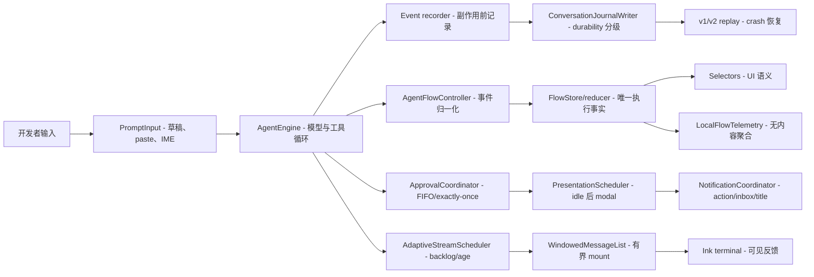

# TurboFlux 开发者心流实施报告

> 日期：2026-07-29（Asia/Shanghai）
>
> 模式：OpenVC `hybrid/audit`，项目级 `max` 证据深度；Codex 官方手册、最新固定源码与 TurboFlux 关键生命周期人工复核。
>
> 状态：工程实现与本地质量门禁完成；Flow 语义 UI、degraded recovery、平台注意力适配、分块回退和终端基线工具已接入。物理 paint SLO、真实设备矩阵、发布周期和明确延期项不包含在“已验证”结论中。

## 1. 交付结论

本轮不是视觉仿制 Codex，而是把最破坏开发者控制感的状态不确定性工程化关闭：审批不再共享单一 resolver，steer 有明确 ack/restore，能力边界不再等同于 approval policy，会话 owner 统一，journal 热路径批量化，长 transcript 有界 mount，后台结果不再按短 TTL 消失；现有状态栏和输入提示已直接读取 Flow selectors，不新增页面或多栏布局。

**审计判定**

- **当前状态：** P0 correctness/capability 风险已获得代码与测试防线；P1 输入、恢复、渲染和身份链路已形成可重复门禁；Flow phase/action/queue、输入回执和普通宽度 inbox 已进入默认 TUI。
- **主要剩余风险：** `App.tsx` 仍是 mixed-layer 巨型文件；真实 ConPTY smoke 已覆盖输入、steer、双队列、resize、状态命令和 journal 顺序，但 Windows Terminal/SSH 的物理 paint、桌面通知送达与完整输入矩阵仍需在目标设备采样。
- **能否继续开发：** 可以，但应保持小范围变更，以 Golden Trace、capability/recovery 测试和双平台 CI 作为强制 tripwire；不适合继续对 `App.tsx` 做无边界的大块 AI 重写。
- **安全边界：** 本报告不是完整安全审计。涉及不可信仓库、host command、凭据或外部 API 时仍需独立威胁建模和 staging 验证。

## 2. 固定基线

| 项目 | 证据 |
| --- | --- |
| Codex upstream | `https://github.com/openai/codex.git` |
| Codex latest SHA | `8bbdf6c8f9ecf4833479c64a4794c9ed6c2dab9b` |
| Codex commit | 2026-07-28T19:58:25Z，`Use the shared HTTP client for TUI network checks (#35821)` |
| Codex 增量判断 | 旧审计 SHA 到 latest 改动了 OSS provider/update 网络检查；输入、审批、通知、stream、resize 的证据文件未变化 |
| TurboFlux baseline commit | `f13985ef719948d911bb748effa469bfbc4741a5` |
| OpenVC 最终范围 | 284 个文件，未截断：`src` 272、`.turboflux/agents` 2、`scripts` 3、`docs` 7 |
| TypeScript 规模 | 277 个 TS/TSX 文件、100 个测试文件、约 51,910 行（PowerShell `Measure-Object -Line`） |
| 既有工作树 | `promo-video`、侧栏和其他用户修改均保留；本报告只归因 flow 改造文件 |

## 3. Codex CLI 源码结论

Codex 支持心流的核心不是某个 spinner，而是“意图、事实、展示、副作用”之间的纪律：

1. `AppEvent`、thread event 与 app-server event 汇聚到明确主循环，避免组件各自拥有终端事实。
2. 输入区分 submitted-pending-start、queued、pending steer、committed、rejected/restored，提交不等于服务端已接受。
3. stream 拆为 append-only stable region 与 mutable tail，并从 canonical source finalize。
4. backlog depth 与 oldest age 驱动 catch-up，迟滞防止模式抖动，frame request 会合并。
5. 审批事实立即可见，但 modal 在用户刚输入后延迟展示；FIFO 保证多个请求不争抢焦点。
6. 后台线程、terminal title、通知 priority、paste burst 与 resize reflow 都被作为状态生命周期处理。

这些机制只能支持及时反馈、可恢复性和控制感，不能证明用户进入心理学意义上的“心流”。详细源码图、固定链接和解释限制见 [开发者心流工程蓝图](./developer-flow-engineering-blueprint.md)。

## 4. TurboFlux 系统地图



纯文本阅读：用户输入先进入 AgentEngine；关键事件在副作用前进入 conversation journal，同时由 AgentFlowController 归一化为 Flow 每线程事实。审批由独立 registry 结算，展示与通知再从唯一事实源派生。stream 先合并再进入有界 transcript window。Telemetry 只观察数值，不参与控制逻辑。

### 4.1 完整运行生命周期

1. `PromptInput` 接受 draft、附件、paste/IME，并把用户活动通知审批与 stream scheduler。
2. App 乐观显示 prompt；ConversationManager 以 critical durability 记录提交和 interaction state。
3. AgentEngine 发布稳定 input ID 的 accepted/committed/rejected；拒绝或首 token 前中断会恢复 prompt。
4. 模型若请求 tool，capability gate 先判断“能不能”；approval policy 再判断“是否询问”。
5. `ApprovalCoordinator` 以 request ID 入 FIFO；Action Required 立即出现，modal 等 composer idle。
6. 工具结果、stream 和 run 终态回到 event recorder 与 AgentFlowController，再由 selectors 投影到 UI。
7. Stream delta 由 scheduler 合并，journal 批量落盘；WindowedMessageList 只 mount viewport + overscan。
8. 后台 result 进入持久 inbox，直到 `/inbox clear` 显式确认。
9. 进程结束时写入数值 telemetry；重启从 conversation/runtime journal 恢复，不自动执行中断审批。

## 5. 实现清单

### 5.1 状态事实与迁移

| 文件 | 责任 | 结果 |
| --- | --- | --- |
| [`src/shared/flowEvents.ts`](../src/shared/flowEvents.ts) | Flow schema v2、envelope、per-thread seq factory | 所有 flow 事件具备 schema/event/session/thread/seq identity |
| [`src/cli/state/flowReducer.ts`](../src/cli/state/flowReducer.ts) | run/input/approval/tool/stream/runtime/notification 状态机 | 重复事件幂等、terminal 不逆转、违规可观测 |
| [`src/cli/state/flowStore.ts`](../src/cli/state/flowStore.ts) | 每线程 state 与 active thread snapshot | thread 隔离与稳定订阅 |
| [`src/cli/state/flowSelectors.ts`](../src/cli/state/flowSelectors.ts) | busy、needs-action、queue、primary activity | UI 不需重新猜测 domain phase |
| [`src/cli/state/agentFlowController.ts`](../src/cli/state/agentFlowController.ts) | AgentEvent 归一化、run/queue/usage/task/FastContext/tool draft 协调 | FlowStore 成为 Agent 执行状态唯一事实源，React 不再保留平行 owner |

### 5.2 审批、输入与安全

| 文件 | 责任 | 结果 |
| --- | --- | --- |
| [`src/core/runtime/approvalCoordinator.ts`](../src/core/runtime/approvalCoordinator.ts) | `Map<requestId, Deferred>`、FIFO、abort/destroy settlement | 关闭并行审批 resolver 覆盖和永久等待 |
| [`src/core/agentEngine.ts`](../src/core/agentEngine.ts) | input ID、steer accepted/committed/rejected、event recorder | 输入拥有可查询终态，UI listener 不再先于 durable recorder |
| [`src/cli/state/approvalPresentationScheduler.ts`](../src/cli/state/approvalPresentationScheduler.ts) | composer idle delay、cancel/replace/destroy | 阻塞立即可见但不突然抢输入焦点，无 ghost timer |
| [`src/core/runtime/capabilityBoundary.ts`](../src/core/runtime/capabilityBoundary.ts) | canonical path、filesystem/command capability | approval 与 sandbox/capability 正交 |
| [`src/core/runtime/nodeToolExecutor.ts`](../src/core/runtime/nodeToolExecutor.ts) | 在实际文件/命令副作用前执行 gate | 默认 workspace-write 阻止外部路径和 host command |
| [`src/core/config.ts`](../src/core/config.ts) | capability profile 配置与校验 | CLI/config/runtime 使用同一 profile |

### 5.3 持久化与身份

| 文件 | 责任 | 结果 |
| --- | --- | --- |
| [`src/cli/conversations/journalWriter.ts`](../src/cli/conversations/journalWriter.ts) | critical/terminal/streaming durability、delta coalescing、失败批次保留与 retry | 热路径不再 per-delta 物理写；失败 entry 不会因抛错而丢失 |
| [`src/cli/conversations/store.ts`](../src/cli/conversations/store.ts) | v1/v2 replay、损坏尾行、未闭合工具、interaction recovery | 老数据可读，crash 后恢复 queue/draft/steer/approval |
| [`src/cli/conversations/manager.ts`](../src/cli/conversations/manager.ts) | writer 集成、状态 snapshot、persistence health/retry/export | degraded 时为 App 提供全局提交门禁和可执行恢复路径 |
| [`src/cli/conversations/recoveryExport.ts`](../src/cli/conversations/recoveryExport.ts) | 非覆盖恢复包、凭据键与常见 token 脱敏 | 不修改原 journal，允许在只读降级状态保存恢复证据 |
| [`src/core/runtime/sessionRegistry.ts`](../src/core/runtime/sessionRegistry.ts) | conversation/session identity 与 switch guards | ConversationManager、AgentRuntime、task owner 不再各自漂移 |

### 5.4 渲染、输入与注意力

| 文件 | 责任 | 结果 |
| --- | --- | --- |
| [`src/cli/state/adaptiveStreamScheduler.ts`](../src/cli/state/adaptiveStreamScheduler.ts) | depth/age、catch-up、迟滞、input-priority | 替换固定 80ms 可见 flush，burst 合并为少量 paint |
| [`src/cli/components/transcriptWindowing.ts`](../src/cli/components/transcriptWindowing.ts) | 高度索引、viewport/overscan、anchor、pin | 10k cell 保持有界 mount |
| [`src/cli/components/messages/WindowedMessageList.tsx`](../src/cli/components/messages/WindowedMessageList.tsx) | top/bottom spacer 与实测高度回填 | 将 window projection 接入真实 Ink 树 |
| [`src/cli/hooks/useTerminalSize.ts`](../src/cli/hooks/useTerminalSize.ts) | 共享 terminal size external store 与单 resize listener | 多组件订阅不再触发 EventEmitter listener 泄漏警告 |
| [`src/cli/components/markdown/index.ts`](../src/cli/components/markdown/index.ts) | 512 项/4 MiB LRU 与 hit/eviction 统计 | 已提交 Markdown 不反复格式化且 cache 有界 |
| [`src/cli/components/input/terminalInputStateMachine.ts`](../src/cli/components/input/terminalInputStateMachine.ts) | paste burst、IME/non-ASCII、Enter guard | Windows 非 bracketed paste 不因内部换行误提交 |
| [`src/cli/state/notificationCoordinator.ts`](../src/cli/state/notificationCoordinator.ts) | priority、dedupe、persistent inbox、terminal title、禁用回退 | 后台结果不再 6 秒后消失，关闭分块时不产生第二个 owner |
| [`src/cli/platform/terminalAttention.ts`](../src/cli/platform/terminalAttention.ts) | focus reporting、固定分类桌面通知、去重、reduced-motion | 只在明确失焦时通知且不传用户内容；未知焦点保持安静 |
| [`src/cli/state/flowFeatureFlags.ts`](../src/cli/state/flowFeatureFlags.ts) | UI/window/notification/scheduler/journal batching 启动时开关 | 每块独立回退；journal safety gate 始终保留 |
| [`src/cli/commands/index.ts`](../src/cli/commands/index.ts) | `/inbox`、`/capability`、`/flow status|retry|export` | 用户获得显式查看、恢复、导出和安全收敛路径 |
| [`src/cli/components/App.tsx`](../src/cli/components/App.tsx) | 现有 UI 的薄集成适配 | Flow selectors 驱动状态栏/输入提示；degraded 时保留输入并阻止新 Agent run |

### 5.5 可观测性与交付

| 文件 | 责任 | 结果 |
| --- | --- | --- |
| [`src/cli/telemetry/localFlowTelemetry.ts`](../src/cli/telemetry/localFlowTelemetry.ts) | 固定数值 metric、本地原子 snapshot | 不记录 prompt、回答、命令、内容或绝对路径 |
| [`src/cli/telemetry/terminalLatencyTracker.ts`](../src/cli/telemetry/terminalLatencyTracker.ts) | key/submit/delta 到下一次 stdout flush 的有界采样 | 区分 Ink render CPU 与 terminal stream flush，不冒充物理 paint |
| [`src/cli/telemetry/terminalBaseline.ts`](../src/cli/telemetry/terminalBaseline.ts) | histogram 分位上界、环境白名单、proxy/paint 分层门禁 | 生成可比较且不含路径/内容的矩阵报告 |
| [`scripts/terminal-flow-baseline.ts`](../scripts/terminal-flow-baseline.ts) | ConPTY/SSH 标签、可选 ANSI DSR probe、外部 paint evidence | `--strict` 仅在 proxy 与真实 paint 证据都达标时通过 |
| [`src/cli/state/goldenTraces.ts`](../src/cli/state/goldenTraces.ts) | 固定 12 条 release-gating 场景目录 | 防止新增 trace 后漏接 CI |
| [`src/cli/state/goldenTraces.test.ts`](../src/cli/state/goldenTraces.test.ts) | 跨 reducer/coordinator/window/input 的场景回放 | 把用户控制权变成可回归契约 |
| [`scripts/flow-performance.ts`](../scripts/flow-performance.ts) | 结构微基准与阈值 | 捕获 O(n) mount、cache 失效、coalescing 回退 |
| [`.github/workflows/flow-quality.yml`](../.github/workflows/flow-quality.yml) | Ubuntu/Windows `ci:flow` | 平台差异进入持续集成 |

## 6. 十二条 Golden Trace

| # | 固定名称 | 保护的用户承诺 |
| ---: | --- | --- |
| 1 | `plain-text-answer` | 普通提交、stream 与 run 只完成一次 |
| 2 | `write-file-approval` | 写工具只有在审批结算后运行 |
| 3 | `parallel-mcp-approvals` | 两个并行审批 FIFO 展示且全部结算 |
| 4 | `streaming-steer` | steer accepted/committed 不重复 |
| 5 | `turn-tail-steer-race` | turn 尾部 steer 被拒绝并恢复，不静默丢失 |
| 6 | `recoverable-error-queued-input` | 可恢复错误后 queue 保持等待，不误跑 |
| 7 | `interrupt-before-first-token` | 首 token 前中断恢复 prompt 与附件 |
| 8 | `tool-crash-recovery` | crash 后在途工具以 cancelled/failed 终态闭合 |
| 9 | `long-table-stream-resize` | 长表格 resize 保留 canonical committed source |
| 10 | `background-thread-approval` | 后台审批不破坏前台 draft/thread |
| 11 | `ten-thousand-line-transcript` | 10k transcript 只 mount 有界窗口 |
| 12 | `windows-paste-and-ime` | paste/IME 字符与换行不被误提交或丢失 |

目录测试额外断言名称恰好 12 个且不重复，因此当前文件共有 13 个测试用例。

## 7. 性能与验证证据

### 7.1 已通过的实现阶段样本

执行环境：Windows、当前 workspace、Node/Vitest 依赖版本，以 `npm run perf:flow` 输出为准。

| 门禁 | 最近成功样本 | 阈值/判断 |
| --- | ---: | --- |
| 10k transcript projection p95 | 3.113ms | ≤50ms，且不是实际 paint |
| 10k mounted cells | 31 | ≤100 |
| resize 80↔160 columns p95 | 6.983ms | ≤500ms，只有高度估算/投影 |
| 10k reducer events | 4.899ms | ≤1,000ms |
| Markdown cache hit rate | 90% | ≥85% |
| 1,000 delta burst | 0.961ms，1 个 scheduler flush，depth 1,000 | enqueue+flush ≤250ms |
| journal coalescing p95 | 0.031ms | 100KB batch p95 ≤50ms |

这些结果证明 window projection、reducer、cache 与 coalescing 没有明显结构退化；它们不能替代终端输入事件到真实 paint 的采样。

### 7.2 验证矩阵

| 验证 | 当前结果 |
| --- | --- |
| `npm run type-check` | 通过 |
| `npm run test:flow` | 31 个测试文件、194 个测试通过 |
| Golden Trace | 13/13 测试通过，覆盖 12 条固定 trace |
| i18n 用户可见边界 | 4/4 测试通过 |
| `npm run perf:flow` | Node v24.15.0 / win32，所有结构门禁通过 |
| `npm test` | 102 个测试文件；804 通过、3 跳过，共 807 |
| `npm run smoke:tui` | Windows ConPTY 真实 PTY 通过；初始输入、steer、双 queue、四次模型请求、screen/journal 顺序、resize、`/flow status`、无 listener warning 全部断言成立 |
| `npm run build` | 通过 |
| `git diff --check -- . ':!promo-video/src/scenes.tsx'` | 通过；被排除文件中的既有 whitespace 不属于本轮 |

Windows 全套并发首次运行时，3 个真实子进程测试触发 Vitest 默认 5 秒 timeout；单文件 40/40 通过且耗时约 3.1–4.6 秒。仅这 3 个进程集成测试改用 15 秒局部 timeout，全局 timeout 与运行时代码未放宽；当前全套 100 个测试文件通过。

## 8. 架构健康与剩余风险

| 严重度 | Smell / 缺口 | 当前控制 | 下一步 |
| --- | --- | --- | --- |
| P2 | `App.tsx` 巨型文件、UI/domain/infra 混层 | coordinator 与纯模块已抽离，Golden Trace 防回退 | 按 approval、stream、session integration 三个稳定边界逐步拆分 |
| P2 | Flow 已单源，但 `App.tsx` 仍承担大量事件适配与展示协调 | ownership 防回退测试、controller/reducer tests、真实 ConPTY smoke | 后续只按稳定边界小步拆分，不重新引入 React 执行状态 |
| P2 | 基线工具已实现但物理 paint/终端矩阵证据未采集 | stdout histogram、DSR probe、外部 evidence schema、strict gate | 在 Windows Terminal/ConPTY/SSH 真实设备逐格采样 |
| P3 | 桌面通知调用已实现但真实 OS 送达矩阵未验收 | 固定分类、显式失焦、去重、关闭开关、平台参数测试 | 在 Windows/macOS/Linux 验证送达与勿扰策略 |
| P3 | terminal title 使用固定英文品牌短语 | 内容已 sanitize 且不含用户数据 | 后续在不引入控制字符风险下接入 locale |

## 9. 延期项与不应误报的结论

以下项目没有完成，发布说明不得宣称已经具备：

- Windows/SSH 矩阵下的 terminal physical paint、submit-to-echo、delta-to-tail SLO 达标；
- “用户进入心流”的心理学证明；
- Windows Terminal/SSH 上的真实终端输入、resize 与通知矩阵；
- 8–12 名目标用户任务研究；
- 对整个 agent/tool surface 的完整安全认证。

## 10. 发布交接

### 10.1 合并前顺序

1. 运行 `npm run type-check`。
2. 运行 `npm test`。
3. 运行 `npm run perf:flow` 并保存 JSON。
4. 运行 `npm run smoke:tui`。
5. 运行 `npm run build`。
6. 运行 `git diff --check -- . ':!promo-video/src/scenes.tsx'`。
7. 人工检查 `git status --short`，确认没有把用户既有文件归入本轮。
8. 更新本报告的最终结果与蓝图 DoD。

### 10.2 后续安全提示词

```text
在修改 TurboFlux Agent/UI 状态流前，先列出用户输入、事件记录、模型调用、工具能力边界、审批、journal、Flow reducer、通知与最终 UI 的完整生命周期。
不要扩大 tool/capability 权限，不要在 React 中新增第二个事实状态，也不要删除 v1/v2 journal 兼容。
只改动目标所需的最小边界，并为受影响路径补 Golden Trace 或定向测试。
交付时给出 changed files、type-check、全量 tests、performance gate、build、diff check 和仍未验证的真实终端风险。
```

值班处置、数据位置和回滚顺序见 [开发者心流运维手册](./developer-flow-operations-runbook.md)。
